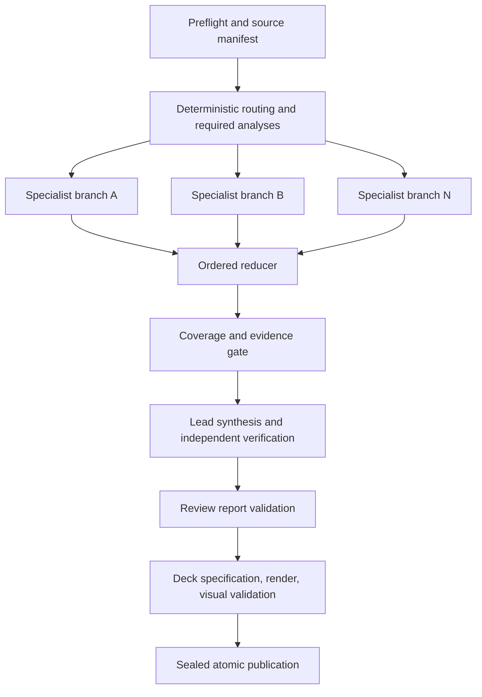
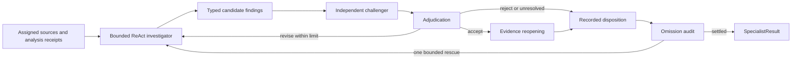

# Plan 1: static controlled graph with specialist agents

Status: proposed architecture alternative; not the current review runtime.

Proposed architecture ID: `static_graph`.

This deep dive expands [the three-plan proposal](three-agent-review-ppt.md) for architecture
review and implementation planning. The [current runtime](../architecture/general-agent-review-runtime.md)
uses `AgentReviewService` and a model-directed ReAct agent; its former parent and specialist
graphs have been removed. Plan 1 describes a possible replacement in a separate evaluation or
migration effort. It does not call for adding a second production review coordinator.

## Decision and outcome

Code chooses the stage order, source assignments, and transitions. Agents investigate within
assigned branches; they do not choose the next review stage. The parent waits for all required
branches, merges their typed outputs, verifies coverage and evidence, then permits a lead to
synthesize the report. A deterministic presentation pipeline converts an accepted report into
an evidence-backed `review.pptx` and validates it before publication.

The same external review semantics apply to all three alternatives:

- The compatibility baseline is `AgentReviewService.start(ReviewRequest)`, `resume(path)`, and
  `status(path)`, returning schema-version-2 `AgentReviewResult`. `interrupted` is resumable;
  `completed` requires a validated, sealed bundle. Disclosed unresolved questions remain in a
  completed report, with no separate warning status.
- The source root, output root, models, budgets, tool permissions, presentation template, and
  executable skills are host-controlled. The combined proposal's `ReviewDeckRequest` is a
  conceptual product contract, not an existing public API.
- The proposed deck capability adds a typed review-to-deck specification, `review.pptx`, deck
  validation evidence, and provenance to the sealed bundle. Presentation options should be
  additive to the existing entrypoint rather than introducing another coordinator.
- Every in-scope source receives a disposition. Required deterministic analyses have receipts.
  Every material finding and slide claim points to evidence that can be reopened against a
  recorded source digest. No model output alone marks a gate complete.

## Runtime shape

### Parent graph

1. **Preflight and freeze.** Resolve the configured source and output roots, enforce their
   separation, discover supported files, profile them, assign stable IDs, hash contents, and
   persist the manifest. An unsupported or corrupt source receives an explicit disposition or
   causes a defined failure; it cannot silently disappear.
2. **Route and analyze.** Host rules classify each source against registered domain skills.
   Unknown content gets a conservative assignment. Trusted deterministic skill entrypoints
   run before model research and store immutable analysis receipts and candidate IDs.
3. **Fan out.** Create one immutable assignment per branch, each with exact source IDs, domain
   skill, budget, and branch checkpoint namespace. A host concurrency limit bounds parallel
   branches. The parent passes only assigned source handles and analysis receipts.
4. **Reduce.** Validate each `SpecialistResult` before admission. Merge in stable assignment
   order, regardless of completion order. Keep contradictory findings and duplicate claims
   visible for synthesis; do not use last-writer-wins state updates.
5. **Gate and synthesize.** Check source, assignment, deterministic-candidate, and evidence
   ledgers. The lead sees validated branch envelopes, not arbitrary raw-source access. An
   independent lead verifier tests support, severity, omissions, and contradictions. A bounded
   revision may correct the draft; it cannot create missing branch evidence.
6. **Validate and publish.** Reopen retained evidence, validate the report and deck spec,
   render the PPTX, reopen the package, inspect rendered slides for layout defects, and seal
   the bundle. Only a complete validated bundle yields `completed`.

### Specialist branch

The investigator can make bounded, read-only calls to shared source tools scoped to its
assignment. The challenger receives an independent context and attempts to falsify material
claims. Adjudication records a decision for every candidate version. Code reopens accepted
locators and checks source digests. The omission audit reconciles deterministic analysis
candidates, investigated claims, rejected claims, and disclosed uncertainty. Revision and
rescue counters prevent indefinite branch cycles.

### State and ownership

| State | Owner | Durable unit |
| --- | --- | --- |
| Manifest, hashes, routing, required analyses | Host | Preflight and routing checkpoint |
| Investigation transcript and provisional claims | Specialist branch | Branch checkpoint |
| Accepted `SpecialistResult` envelope | Parent reducer | Assignment ID and result digest |
| Coverage, finding versions, verification decisions | Host | Post-reduction checkpoint |
| Lead report, deck spec, sealed artifacts | Host publication flow | Validation and bundle commit |

Branches may append only to their own state. They cannot change a sibling assignment, mutate
the parent ledger, delegate to another branch, or publish artifacts. Shared source readers and
skill registration belong in `data_agent/tools` and `data_agent/skills`; review policy and
persistence belong in `data_agent/review`.

## Recovery, boundaries, and failure policy

Checkpoint before fan-out, after each accepted branch, after reduction, and around sealed
publication. A stable assignment ID and input digest identify reusable branch work. On resume,
recheck source hashes and load accepted branch envelopes; rerun only unsettled branches. The
reducer must produce the same result after any legal completion order. If a crash occurs after
bundle sealing but before status commit, validate and adopt that same sealed bundle rather than
publishing a duplicate.

Retry only classified provider or transport failures within their original budgets. A source
edit, invalid evidence locator, corrupt checkpoint, missing required branch, or exhausted
aggregate budget follows a deterministic failure path. An ordinary turn that stops before
publication is `interrupted` only when the persisted state is safely resumable. Branch-level
failures never become successful coverage through lead prose.

The source scope is fixed at preflight. A newly added or changed file is source drift and
blocks continuation under this plan; a fresh run can review a different snapshot. Model
arguments cannot choose executable skills, models, credentials, paths outside the source root,
or unrestricted filesystem, process, Python, network, or presentation-writing tools.
Low-cost models handle research and challenge; high-cost models handle adjudication and lead
work according to host configuration.

## Tradeoffs and implementation path

The graph gives explicit checkpoints, stage-specific retry policy, and strong branch
isolation. Its cost is more state and reducer code, plus less freedom to reprioritize work
after a branch starts. Parallelism is predictable because code creates the fan-out. Changes
to domain routing or review stages require a workflow change rather than a new supervisor
decision.

An implementation would first freeze shared manifest, evidence, report, and presentation
contracts. It would then define typed parent and branch states, routing rules, idempotent
reducers, and checkpoint keys. Next it would integrate trusted deterministic analyses and
isolated specialist branches, followed by lead verification and the common deck pipeline.
This is an alternative to the current runtime: evaluate it in isolation before any migration,
and keep one public service contract and one authoritative run record.

## Acceptance scenarios

- Randomize branch completion order and prove the merged report, coverage ledger, and finding
  identities are identical.
- Crash before fan-out, during two parallel branches, after reduction, and after bundle seal;
  resume without repeating accepted branches or creating a second bundle.
- Inject an omitted source, missing analysis receipt, unsupported claim, changed digest, and
  conflicting specialist conclusions; each receives the expected disposition or fatal gate.
- Use mixed tabular and document sources, a clean no-findings run, and a warning-heavy run;
  all successful decks reopen, render legibly, and preserve finding and source provenance.
- Measure coverage, supported-claim precision, model and tool calls, tokens, elapsed time,
  peak concurrency, retries, and recovery work against the other two plans on the same
  pinned source snapshot.
