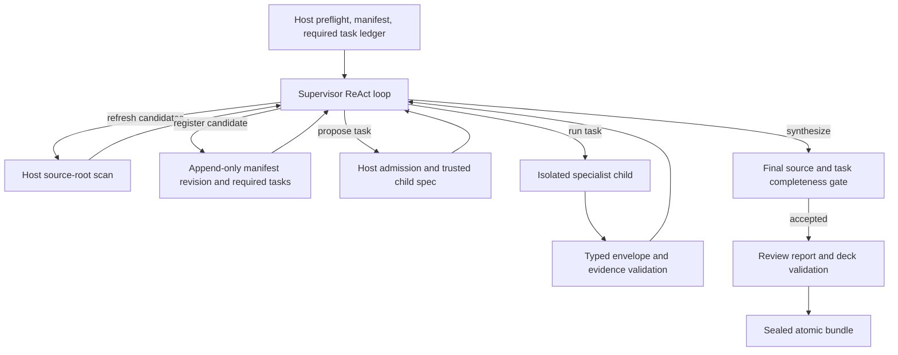
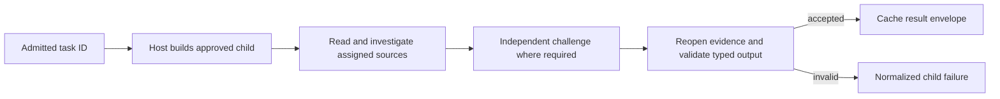

# Plan 2: supervisor with controlled dynamic specialist subagents

Status: proposed architecture alternative, extending [the original Plan 2](three-agent-review-ppt.md).

Proposed architecture ID: `supervisor_subagents`.

The original Plan 2 gives a supervisor a fixed task ledger and one `run_specialist` command.
This deep dive adds a controlled way to discover new local files and propose specialist tasks
during a run. It does not describe the
[current production runtime](../architecture/general-agent-review-runtime.md) or grant the
model authority to define executable agents. It is intended for both architecture review and
implementation planning.

## Decision and outcome

A supervisor ReAct agent decides which pending tasks to run, whether extra investigation is
needed, and when to synthesize. A host-owned shell retains authority over source intake, task
admission, child construction, evidence, budgets, and publication. A new subagent here means
a new **instance and objective** built from an approved specialist template. Adding a truly
new tool, skill entrypoint, credential, model, or executable role requires a host registry
change outside the run.

All three plans target the same product result: every in-scope source receives a disposition,
required deterministic analyses have receipts, material claims have digest-bound evidence,
unresolved questions are disclosed, and a readable `review.pptx` passes package and visual
validation before the bundle is sealed. The compatibility baseline is the existing
`AgentReviewService` `start`/`resume`/`status` interface and schema-version-2
`AgentReviewResult`: `interrupted` is resumable and `completed` means the validated bundle
exists, even when it discloses unresolved items. The combined proposal's illustrative
`ReviewDeckRequest` and `completed_with_warnings` status are not current APIs.

## Runtime shape

The initial host scan registers the run's starting sources and creates mandatory domain
tasks. The supervisor can schedule those tasks in any order and request several independent
children in parallel. It can also ask for a new task or register a newly discovered local
file. Every mutation is admitted and persisted by the host before the child runs. The
supervisor sees bounded status and accepted result envelopes, never unrestricted child
transcripts or raw access to every source.

### Host-owned command surface

| Command | Model-supplied input | Host action and result |
| --- | --- | --- |
| `refresh_source_candidates` | None | Return host-discovered candidate IDs and bounded metadata. |
| `register_local_source` | Candidate ID | Append a validated manifest revision and required tasks. |
| `propose_specialist_task` | Source IDs, domain, objective | Admit a bounded task. |
| `run_specialist` | Task ID | Reserve, execute, validate, and cache one child attempt. |
| `get_task_progress` | None | Read source, task, analysis, and budget summaries. |

The model never supplies a filesystem path to open. `refresh_source_candidates` performs
the enumeration, and `register_local_source` accepts only its opaque ID. The host rejects
symlinks, traversal, unsupported or corrupt content, source/output overlap, size and count
limit breaches, changed digests, and stale candidate IDs. These commands introduce no
network, arbitrary filesystem, process, Python, or write capability for a child.

### Dynamic source and task lifecycle

1. **Initial snapshot.** Preflight discovers and hashes all files under the host-configured
   source root, assigns stable IDs, and creates mandatory tasks. The initial manifest and
   assignment ledger are persisted before the supervisor runs.
2. **Discover.** A later host scan may find a file added to that root during the run.
   Candidate metadata is informative only; the file is outside review scope until admitted.
   A file already registered but edited is an integrity failure, not a new candidate.
3. **Register.** The host rechecks containment, file type, size, and digest, then atomically
   appends the source to a new manifest revision. Existing source records and digests never
   change. Routing adds required domain analysis and task entries. The revision and reason
   for intake become part of the run trace.
4. **Propose.** The supervisor may add investigation beyond mandatory tasks, including an
   objective that no initial task expressed. The host admits it only for registered sources
   and a registered domain. It chooses the prompt template, allowed tools, trusted skill
   from host-configured `SKILLS_DIR`, model cost tier, schema, and limits. A proposal cannot
   turn a child into another supervisor or select executable code.
5. **Run and reconcile.** Each child receives a fresh context, one admitted task, and exact
   source IDs. The host completes required deterministic analysis where applicable; the
   child investigates with bounded read tools and returns a typed envelope with findings, evidence,
   analysis receipts, limitations, and usage. The host validates and caches accepted output
   before showing its summary to the supervisor.
6. **Freeze and publish.** Before accepting synthesis, the host performs a final source-root
   scan. Newly found candidates cause a bounded intake cycle while expansion budget remains;
   any unregistered in-scope file still present at freeze blocks completion. Publication
   rechecks registered digests and validates the report, deck, and sealed bundle.

The dynamic intake limit is host-configured and counted against the same aggregate run
budget. Reaching the intake limit or deadline with unsettled source obligations fails the
run; supervisor prose cannot exempt a file or mark its tasks complete. Fixed
source-snapshot benchmarks can disable additions for parity with Plans 1 and 3.
The current source-integrity check treats an added file as drift; this proposal would
introduce versioned intake for additions while retaining failure on edits to registered files.

### Child isolation and result contract

The child cannot alter the ledger, register sources, create grandchildren, synthesize the
whole report, render slides, or publish. Its raw conversation remains isolated. The result
envelope must identify the task, manifest revision, assigned sources, analysis receipts,
finding versions, evidence, warnings, unresolved items, and usage. Host validation checks
that every locator belongs to an assigned source and still matches its registered digest.
Independent challenge and adjudication for material findings remain governed by review
policy, not by whether the supervisor asks for them.

## Authoritative state, recovery, and failure policy

The host persists manifest revisions, task proposals and decisions, task state, reserved
budgets, child attempts, accepted envelopes, and supervisor checkpoints separately from
model prose. A task transitions through pending, running, completed, or failed, with
limitations recorded in the envelope rather than a public warning status. The child task
ID and canonical proposal digest make replay idempotent. Repeating an accepted `run_specialist`
call returns the cached envelope; changing its arguments under the same call ID is rejected.
Concurrent calls reserve attempts and slots atomically. A failed sibling cannot erase a
successful result.

On resume, the host revalidates the current manifest revision and all registered hashes,
restores remaining aggregate budgets, and reuses accepted child output. An interrupted
child can be attempted again only under retry policy with a new bounded attempt; source
integrity and validation failures are final. A manifest revision invalidates any already
drafted whole-review synthesis, while accepted child results scoped to unchanged source
digests remain reusable. Sealed publication uses a stable bundle identity so a crash after
seal can be recovered without duplicating artifacts.

The final gate checks that every manifest source has a disposition, each required task and
analysis receipt is settled, every retained finding has independent verification and valid
evidence, conflicts have explicit dispositions, and no child result was silently omitted.
The deck planner consumes only this accepted report. It emits a provenance-carrying deck
spec; code renders `review.pptx`, reopens it, checks rendered slides, and seals the full
bundle. A valid narrative without a valid deck cannot become `completed`.

## Tradeoffs and implementation path

This design can reprioritize work and add an investigative task when evidence suggests a
new angle. Fresh children keep domain contexts small. The extra flexibility costs more
admission, persistence, and budget accounting than the fixed-ledger Plan 2: dynamic source
intake must reconcile manifest revisions with existing work, and supervisor turns add model
cost and output variance. A model may still omit a task; deterministic gates remain essential.

Build the shared source, evidence, review, and deck contracts first. Then add the task
ledger, validated child template registry, one-level runner, envelope cache, and supervisor
loop. Add dynamic intake as an explicit extension: host-only candidate discovery, atomic
manifest revisions, new mandatory tasks, and a bounded final freeze. Finally integrate
report and deck publication. This would be evaluated as an alternative to the current
runtime, not installed beside it as another production coordinator.

## Acceptance scenarios

- The supervisor creates an extra objective for an existing source; the host admits a new
  task instance but refuses model-supplied tools, prompts, executable skills, or model names.
- A file appears under the source root mid-run; registration assigns an ID, creates required
  analysis and task entries, and blocks synthesis until they are settled. A path outside the
  root, symlink, changed registered file, or stale candidate ID is rejected.
- Parallel children finish in different orders, one times out, and the process crashes
  before a tool receipt; accepted sibling envelopes are reused exactly once on resume.
- An omitted mandatory delegation, unsupported finding, or unregistered file at freeze
  prevents publication. Contradictory child results require an explicit disposition or
  disclosed unresolved question before the report can pass validation.
- A clean run and a disclosed-uncertainty run both produce one sealed, visually validated
  PPTX with source and finding provenance. Compare coverage, precision, calls, tokens,
  latency, concurrency, and recovery work on pinned snapshots against the other plans.
