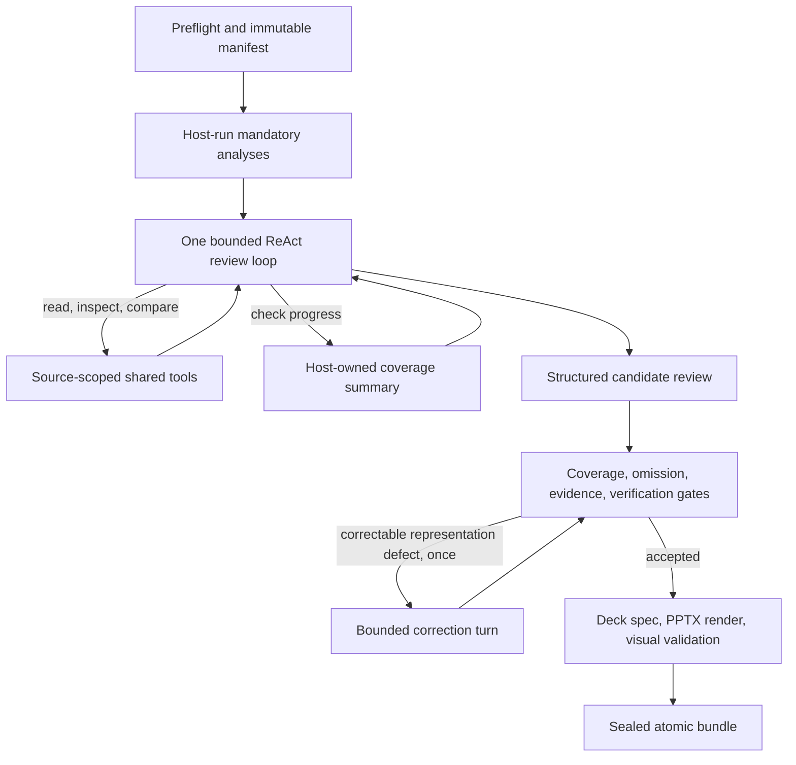

# Plan 3: one general ReAct review agent

Status: proposed architecture alternative; related to, but narrower than, the
[current model-directed runtime](../architecture/general-agent-review-runtime.md).

Proposed architecture ID: `single_react`.

This deep dive expands [the three-plan proposal](three-agent-review-ppt.md) for architecture
review and implementation planning. The current `AgentReviewService` already runs a general
ReAct agent and can delegate to child roles. Plan 3 deliberately removes that delegation:
one review agent plans, investigates, and drafts the whole result in one bounded context.
Host-run analyses, independent verification gates, and deterministic publication remain
outside its decision loop.

## Decision and outcome

The agent chooses source-reading and analysis-result tools until it submits a structured
candidate review. Code does not prescribe the order of those reads. It does create the full
source manifest and required deterministic analysis receipts before the loop, track progress
independently of model prose, validate the candidate, and produce a deck only from accepted
review data. There are no specialist child conversations, branch reducers, or supervisor
task ledger.

The same external review semantics apply to the other plans. Preserve
`AgentReviewService.start(ReviewRequest)`, `resume(path)`, and `status(path)` as the public
compatibility baseline, with schema-version-2 `AgentReviewResult`. `interrupted` represents
resumable work; `completed` requires a sealed, validated bundle. Disclosed unresolved
questions do not create a separate warning status. The combined proposal's
`ReviewDeckRequest` and `completed_with_warnings` are illustrative older contracts, not
current APIs. A future deck capability adds review-to-deck content, `review.pptx`, validation
records, and provenance to the bundle without giving the agent artifact-writing tools.

## Runtime shape

### Before the agent loop

Preflight validates the configured source and output roots, discovers every in-scope file,
profiles and hashes content, and creates stable source IDs. The host routes supported
domains to trusted deterministic skill entrypoints from host-configured `SKILLS_DIR`.
Mandatory checks run and store receipts and candidate IDs before the agent sees a tool.
Unsupported or corrupt inputs receive an explicit disposition or defined failure.

The initial prompt contains a compact manifest, review objective, analysis summary,
coverage requirements, and remaining limits. It does not embed entire documents. The
agent receives a bounded catalog of read-only tools for assigned sources and analysis
receipts. It cannot select executable code, change its model, edit the source root, alter
budgets, write a PPTX, or mark coverage complete by assertion.

### One-agent investigation loop

On each turn the model may read a source, inspect a table, compare bounded observations,
ask `get_review_progress` what is unsettled, or submit a structured review candidate.
Source tools return evidence locators and compact observations while recording host-owned
trace entries. The progress tool reads source dispositions, unread analysis receipts,
unresolved deterministic candidates, accepted evidence IDs, and remaining budget; it
does not let the model edit those records.

The single conversation carries observations from all domains. Context compaction
summarizes older non-authoritative tool output while retaining the manifest, analysis
receipts, accepted evidence identifiers, open obligations, and budget state. Compaction
cannot manufacture a source read or evidence record. The agent may propose cross-source
findings directly because it has one global view, but each claim still needs traceable
support. A structured final response ends the loop, not the review run.

### Post-loop gates and bounded correction

The host checks four ledgers independently: source disposition, mandatory analysis
receipts, deterministic candidate disposition, and retained evidence. It reopens each
material locator against the recorded source digest, checks finding versions and severity
rules, and runs the required independent verification policy. The omission audit compares
the candidate report against all sources and analyses, including items the model never
mentioned. A missing source, missing analysis, unsupported material claim, or undisclosed
unresolved item cannot be excused by the model's confidence.

One correction turn may repair representation defects already backed by recorded facts,
such as a missing reference to an accepted disposition. It receives typed defects and the
relevant accepted records, with a small budget and no new research allowance. Missing
evidence, altered source content, exhausted budget, and unresolved verification failures
follow the defined failure or disclosure policy. There is no open-ended retry loop.

Only an accepted review reaches the common presentation pipeline: a deterministic planner
creates a provenance-carrying deck spec, a renderer builds `review.pptx`, package and
rendered-slide checks catch broken or unreadable output, and the complete bundle is sealed
atomically. Source and finding IDs must remain traceable from review data through the slide
content or speaker notes. A narrative without a valid deck is not `completed`.

## State, recovery, and operating boundaries

The durable unit is a root model or tool step. The host persists the conversation
checkpoint, immutable source identity, analysis receipts, source and candidate ledgers,
accepted evidence, budget reservations, and result artifacts separately from model prose.
Stable tool-call IDs permit reuse of successful read observations after an uncertain
transport outcome. On resume, source hashes and remaining aggregate budgets are checked
before the next step. There is no branch-level partial specialist result to recover; a
long review resumes from its last committed loop step.

If the agent reaches a call, token, time, or recursion limit before a valid report, the run
becomes `interrupted` only when continuation is safe and budget remains; otherwise it
fails with a stable reason. Provider retries are limited to classified transient errors.
Invalid locators, changed source digests, corrupt checkpoints, and fatal validation defects
are not repaired by another model summary. The source set is fixed at preflight: a newly
added or changed file blocks continuation, and a fresh run can review the new snapshot.

The one-agent design has no child delegation tool. Shared source tools stay under
`data_agent/tools`; skill discovery and trusted entrypoints stay under `data_agent/skills`;
models and credentials remain host-configured. Low-cost investigation and high-cost
independent adjudication or lead verification still follow review policy where required.
The fact that only one ReAct agent drives investigation does not waive independent checks.

## Tradeoffs and implementation path

This is the smallest orchestration surface: one loop, one root checkpoint stream, and one
candidate report. It avoids specialist dispatch and result merging, and can connect
cross-domain observations without waiting for branch envelopes. Its main pressure point is
the shared context. Long or heterogeneous reviews can lose important observations during
compaction or spend many turns rediscovering them; omission gates detect incomplete output
but cannot make an exhausted run successful. Work is less naturally parallel than in Plans
1 and 2, and there is no isolated specialist output to cache across partial failures.

Implementation begins with the shared manifest, evidence, report, and deck contracts.
Add the host-run analysis receipt store and complete-source tool catalog, then the
`get_review_progress` read surface and per-step checkpointing. Add bounded context
compaction, structured review output, deterministic omission and evidence gates, one
representation correction, and the shared deck pipeline. Evaluate this as a distinct
no-delegation mode of the current runtime rather than introducing another coordinator.

## Acceptance scenarios

- Run different valid tool orders over the same pinned sources; every accepted result
  settles the same source and deterministic-candidate obligations.
- Review many mixed and oversized files; compaction retains manifest entries, analysis
  receipts, accepted evidence IDs, and open obligations without silently dropping them.
- Submit a confident but incomplete report, an unsupported claim, a prompt-injection
  instruction embedded in a source, and a malformed structured result; none bypasses the
  host's coverage, evidence, or artifact gates.
- Crash after a read tool commits but before its receipt reaches the model; resume without
  repeating accepted work or exceeding the aggregate budget.
- Exercise a correctable formatting defect, a missing-evidence defect, deadline expiry,
  changed source, and failure during correction; each reaches the specified terminal or
  resumable state without publishing an unchecked PPTX.
- Compare coverage, supported-claim precision, deck defects, variance, calls, tokens,
  latency, and recovery work with Plans 1 and 2 on the same source snapshot.
