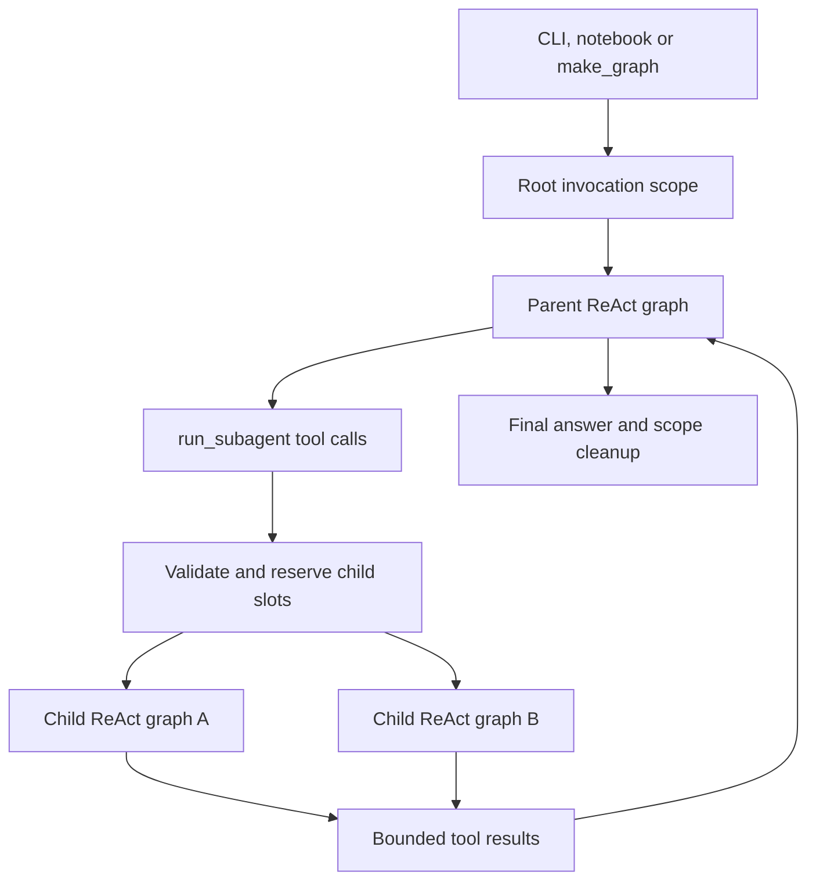

# ReAct sub-agent design and implementation plan

Status: implemented and validated. See [usage and configuration](../subagents.md).
Planned: 2026-09-21. Implementation validated: 2026-09-22.

Enable a conversational ReAct agent to delegate a bounded task to another ReAct agent,
receive its result, and continue reasoning. The user selected **waiting for results,
with parallel execution of independent tasks**. Python execution remains asynchronous;
the parent model resumes after the current group of tool calls completes.

## 1. Scope and architectural decision

Use a single local LangChain tool, `run_subagent`, backed by a small sub-agent module in
`data_agent/agent`. A child runs the same graph-construction implementation as the parent,
with a different prompt, an explicit subset of tools and skills, and fresh messages.

Ship conversational delegation first. The controlled review workflow already has its own
specialist dispatch, evidence validation, and checkpoint contracts. Its research agents
remain consumers of `data_agent/review/llm/runner.py` during this change. Supporting
delegation inside those agents is a separate, explicit extension described below.

The first release supports one level of delegation: a root can start multiple children,
but children cannot start grandchildren. Background jobs, persistent child conversations,
inter-agent messaging, user handoffs, and dynamic executable agent definitions are deferred.

This follows LangChain's documented tool-based sub-agent pattern: the parent controls
delegation and receives a compact result from an isolated child. Parallel tool calls can
launch independent children. The repository-specific limits and module layout below are
design recommendations, not framework defaults.
[LangChain sub-agents](https://docs.langchain.com/oss/python/langchain/multi-agent/subagents)

## 2. Starting code and design implications

| Existing code | Observation | Design implication |
| --- | --- | --- |
| `data_agent/agent/react_agent.py` | `build_agent()` loads MCP tools, discovers skills, builds the model and prompt, then calls `create_agent()`. | Separate resource loading from graph construction; a child must not call `build_agent()` recursively. |
| `AgentBundle.ainvoke()` | Adds recursion configuration and optional trace callbacks. | Keep its interface; enforce delegation policy inside the returned graph so raw graph invocation cannot bypass it. |
| `AgentBundle.all_tools` | Lists MCP and skill tools, omitting supplied `extra_tools`. | Make introspection reflect the actual root tool collection, including extras and delegation. |
| `data_agent/agent/graph.py` | `make_graph()` returns `bundle.agent` directly. | The returned compiled graph must own invocation scope and cleanup. |
| `data_agent/cli.py` | Both chat paths call `bundle.ask()`; each request currently supplies a fresh message. | Preserve current chat behavior and define delegation limits per invocation, without adding chat memory implicitly. |
| `data_agent/review/orchestration/graph.py` | Uses `Send` for predetermined specialist tasks. | Preserve this controlled workflow; its dispatch is different from model-selected chat delegation. |
| `data_agent/tools/research.py` | Binds review research tools to assigned sources and records evidence. | Reuse this interface if review delegation is added later; general chat tools are not equivalent. |
| `data_agent/skills` | Owns discovery, instruction loading, and review skill registration. | Filter existing skills for children; do not create another skill loader or turn every skill into an agent. |
| `data_agent/tracing` | Records callback parent IDs, with review-specific metadata names. | Extend shared tracing to identify children without creating another logging system. |

The lockfile selects LangChain 1.3.17, LangChain Core 1.6.0, LangGraph 1.2.11,
LangGraph Prebuilt 1.1.0, and MCP adapters 0.3.2. Installed source confirms support for
`create_agent(context_schema=..., middleware=..., checkpointer=...)`, injected
`ToolRuntime`, and parallel asynchronous tool execution. Implement against these versions.
Current MCP documentation describes a newer `langchain.mcp` integration requiring
LangChain 1.4; adopting it is outside this feature.
[LangChain MCP integration](https://docs.langchain.com/oss/python/langchain/mcp)

## 3. Implemented folder layout

```text
data_agent/
  agent/
    __init__.py                  # Preserve current public imports
    react_agent.py               # Resource bootstrap, AgentBundle, build_agent
    factory.py                   # Construct a ReAct graph from supplied dependencies
    runtime.py                   # Root invocation scope and compiled lifecycle graph
    prompts.py                   # Root/child prompts and delegation guidance
    graph.py                     # Existing deployment entrypoint
    subagents/
      __init__.py                # Small public interface; no import-time graph creation
      contracts.py              # Spec, request, result, policy, invocation scope
      registry.py               # Explicit trusted specs and validation
      runner.py                 # Delegation admission, child execution and cleanup
      middleware.py             # Enforce child model/tool call limits
  tools/
    delegation.py               # LangChain tool adapter for run_subagent
    ...                         # Existing shared tool implementations
  skills/                       # Existing shared skill machinery
  llm/                          # Existing provider adapters
  mcp_server/                   # Existing MCP transport and registration
  review/                       # Existing controlled review workflow
  tracing/                      # Shared parent/child execution traces
  config.py                     # Typed sub-agent configuration
  cli.py                        # Existing chat/review entrypoints

tests/
  agent/
    test_agent_factory.py
    test_subagent_execution.py
    test_subagent_limits.py
    test_subagent_isolation.py
    test_agent_entrypoints.py
    test_subagent_mcp.py         # Real stdio MCP with synthetic source material
  test_tracing.py                # Extend existing trace behavior tests
```

The deep module is `agent/subagents`: callers request a task and receive a result while
its implementation handles admission, concurrency, budgets, and error normalization.
`tools/delegation.py` contains only the model-facing adapter; tool execution and skill
loading continue to use the existing shared modules.

Keep dependencies acyclic. `contracts.py` has no imports from bootstrap, review, or MCP.
The tool adapter depends on contracts and an injected execution callable. The runner
receives a child graph builder; it does not import `react_agent.py`. Bootstrap composes
these modules. `factory.py` receives tools rather than importing the delegation adapter.

## 4. Small interfaces and ownership

The model sees only:

```python
async def run_subagent(
    agent_name: str,
    task: str,
    context: str = "",
) -> ToolMessage:
    """Run a registered child agent and return a bounded JSON result."""
```

`agent_name` must resolve to a registered spec. `task` describes one outcome; `context`
contains selected facts and source references needed to accomplish it. Validate their
lengths before starting work. The model cannot supply system prompts, model credentials,
tool definitions, filesystem roots, concurrency settings, or execution IDs.

The implementation also accepts an injected `ToolRuntime`, hidden from the model schema.
Use its tool-call ID to construct the `ToolMessage`: serialize the result envelope into
content and set `status="error"` for unsuccessful outcomes. This keeps the parent tool-call
protocol and existing error-aware tracing consistent without discarding the failure details.

The host-facing execution seam is conceptually:

```python
await runner.run(request, scope=scope, config=callback_config)
# -> DelegationResult
```

| Type | Contents and owner |
| --- | --- |
| `SubagentSpec` | Trusted name, description, system instructions, explicit tool names and skill names. Configured by application code. |
| `DelegationRequest` | Validated `agent_name`, `task`, and `context`. Created from tool input. |
| `DelegationPolicy` | Enabled flag, maximum children, concurrency, per-child call limits, timeout and text limits. Created from settings. |
| `RunScope` | Host-generated root/child IDs, depth, shared admission ledger, concurrency slots and active tasks. Exists only during invocation. |
| `DelegationResult` | Host-generated child ID/name/status, bounded output, truncation flag, sanitized error and call counts. Returned to the parent. |

Suggested result statuses are `completed`, `failed`, `timed_out`, `budget_exceeded`, and
`rejected`. The runner determines status; child prose cannot declare execution successful.
Success requires a nonempty final assistant answer with no unresolved tool calls. Normalize
text content blocks as well as plain strings. Do not require provider-specific structured
output for the first release: the runner builds the result envelope around the answer.

Child output should contain findings, source references and limitations. References remain
claims to verify, not automatically accepted review evidence. The parent receives this
envelope as the result of its original tool call, never the child's whole message history.

Keep `build_agent(settings=None, *, model=None, extra_tools=None)` compatible, optionally
adding `subagent_specs=` for trusted application configuration. Preserve injected models
for tests and embedding applications. `AgentBundle.all_tools` must show the exact root
collection passed to graph construction, with duplicate names rejected during bootstrap.

## 5. Invocation lifecycle and parallel work



1. Bootstrap loads the MCP tool catalog and skills once per bundle, validates trusted
   specs, and prepares graph construction dependencies. Children reuse these dependencies.
2. When enabled, `bundle.agent` is a compiled lifecycle graph whose async execution node
   creates a fresh `RunScope`, invokes the parent ReAct graph, and cleans up in `finally`.
   This puts lifecycle ownership underneath `ask`, `ainvoke`, and `make_graph`. Keep the
   existing messages input/output contract and preserve message IDs when mapping results.
3. Pass the scope through runtime context, accessible to tools through `ToolRuntime`.
   Keep live tasks, locks, semaphores, clients and models out of serialized graph state.
   Do not rely on process globals or on context-variable writes in an earlier graph node.
4. Each delegation validates the request, reserves one child attempt atomically, acquires
   a shared concurrency slot, and invokes a child graph with fresh messages. Compile child
   graphs with checkpointing explicitly disabled for this release.
5. Multiple `run_subagent` calls in a parent model response execute concurrently up to
   the application limit. Results retain their original tool-call IDs and tool-call order.
   The parent does not start its next model step until that tool batch finishes.
6. Release resources on success, failure, timeout, cancellation, and stream closure.
   Cancel and await outstanding local child tasks when the root exits. Never retain child
   tasks on a reusable bundle after its invocation ends.

Use runtime context as the dependency-injection mechanism supported by LangChain. A node
that invokes an inner graph is also a supported LangGraph composition pattern. The outer
lifecycle graph is our choice to give cleanup one owner across entrypoints.
[LangChain runtime](https://docs.langchain.com/oss/python/langchain/runtime),
[LangGraph subgraphs](https://docs.langchain.com/oss/python/langgraph/use-subgraphs)

Preserve parent recursion configuration when moving the loop inside the lifecycle node;
an outer graph's small step count cannot enforce an inner graph's limit. Copy callbacks
and safe tracing metadata deliberately. Do not copy parent checkpoint identity or arbitrary
`configurable` values into children. Test inherited framework configuration as well as
explicit config to prove `checkpointer=False` prevents accidental child persistence.

The lifecycle graph adds a graph namespace to streaming updates. Document that detail and
verify `astream`/callback delivery, final state, and cancellation through `make_graph()`.
The existing async interface is the first-release execution contract; avoid introducing
`asyncio.run()` inside tools as an attempted synchronous compatibility layer.

## 6. Capabilities, context and skills

Start with one trusted `research` spec. Its useful initial tools are source listing,
text search, line/document reading, table inspection and row reading. Add other existing
read-only tabular/statistical tools to the spec only when needed. Register exact tool
names from the existing trusted server; do not infer permission from tool descriptions.

Effective child capabilities must be a subset of both the root's authorized capabilities
and the chosen spec. Ordinary `extra_tools` remain root-only unless explicitly configured
for a child. Exclude workspace grep, Python execution and context-debug tools from the
initial child profile. Delegation itself is excluded from every child tool list, and the
runner independently rejects depth greater than one.

For chat, the child retains the parent's configured read-only `SOURCE_ROOT`. Paths mentioned
in a task are relevance hints, not a new file-level authorization guarantee. Continue to
use the existing path/SQL guards. If file-level restrictions are introduced later, enforce
them in every relevant tool, including search, listing, joins and SQL registration.

Use `discover_skills`, `build_skill_tools`, and `render_skills_overview` with a filtered
catalog. Begin with no child skills until specific playbooks are checked against the
child's available tools; then enable compatible ones explicitly. A skill cannot grant
capabilities or register agents. Keep the existing skill-first instruction consistent:
if a root skill applies, load it before delegating; if a child skill applies, load it
before research. Each agent loads its own permitted instructions.

Children receive their trusted system instructions plus the task and bounded selected
context. Source text and child results stay in data/tool messages. Do not promote them
into system instructions or copy the parent's full conversation by default. The parent
prompt should explain when to delegate, how to split independent tasks, and that it owns
the final synthesis and must disclose missing or failed work.

## 7. Limits and failure behavior

Initial settings, subject to tuning with ordinary test fixtures:

| Setting | Default | Enforcement |
| --- | --- | --- |
| `SUBAGENTS_ENABLED` | `false` | Opt-in rollout; disabled builds retain the existing graph and tool surface. |
| `SUBAGENT_MAX_RUNS` | `4` | Total admitted child attempts per root invocation, including failed attempts. |
| `SUBAGENT_MAX_CONCURRENCY` | `2` | Shared across all delegation calls in that invocation. |
| `SUBAGENT_MAX_MODEL_CALLS` | `6` | Reserve before each child model invocation. |
| `SUBAGENT_MAX_TOOL_CALLS` | `12` | Reserve before each child tool invocation, including parallel batches. |
| `SUBAGENT_TIMEOUT_SECONDS` | `120` | Deadline from admission, including waiting for a concurrency slot. |
| `SUBAGENT_MAX_INPUT_CHARS` | `16000` | Combined task/context bound; reject excessive input explicitly. |
| `SUBAGENT_MAX_RESULT_CHARS` | `8000` | Bound the answer field before serializing the result envelope. |

Validate positive limits and concurrency no greater than maximum runs. Root depth is zero;
child depth is one. Keep deeper recursion unavailable in the first release rather than
advertising a setting the implementation cannot safely support.

Implement child call limits with middleware and atomic reservation before dispatch. Graph
recursion limits remain a backstop, not a model/tool-call accounting mechanism. By default,
the entire invocation can start at most four children, totaling at most 24 child model
calls and 48 child tool calls. Parent work retains its existing separate limit. These are
logical invocation counts; provider-internal retries and token use are not a dollar budget.
LangChain supports model/tool wrap hooks suitable for these checks.
[Custom middleware](https://docs.langchain.com/oss/python/langchain/middleware/custom)

Expected failures become bounded results the parent can reason about. An unknown agent
or prohibited capability is rejected before execution. A child timeout or budget failure
does not discard successful siblings. Preserve task cancellation as cancellation: propagate
`CancelledError`, cancel outstanding siblings during root cleanup, and release reservations
in `finally`. Do not silently retry whole children; a parent-requested retry consumes a new
child attempt. Truncated output is explicitly marked.

Timeout bounds local waiting; it cannot guarantee that an already-dispatched provider
request or synchronous server operation has stopped. Keep initial child tools read-only,
use existing transport timeouts, and do not claim remote cancellation or exactly-once work.

The admission ledger can reuse a completed/in-flight result for the same root and tool-call
ID during one invocation. It is not durable deduplication. Process restart or graph replay
may repeat work; persistent child resume and interrupts need a separate design.

## 8. MCP and tracing integration

Reuse the loaded MCP tool objects; do not rediscover tools or create another full bundle
for each child. The installed `MultiServerMCPClient.get_tools()` implementation creates
sessions per tool call, so reusing the client/catalog does not imply a single long-lived
stdio process. Keep that behavior initially and measure startup cost before changing it.
Explicit persistent sessions would require a separate, tested resource lifetime.

`run_subagent` is a local host tool. Do not register it in `mcp_server/server.py`: that
would move model execution and invocation scope into the tool transport process.

Propagate the existing callback chain so parent and children share one logical trace.
Add optional child ID, parent-agent ID, agent name and depth fields to `ExecutionEvent`;
old events must still parse. Teach the handler to read generic agent metadata while
retaining its current review metadata support. Reuse existing tool/model/node lifecycle
events for execution and failure, with timeout/budget details in normalized errors.

Keep result previews off by default. In addition, suppress task/context bodies in delegation
tool arguments: current argument logging can record those even with result previews off.
Record identifiers, lengths and status instead. Verify callback inheritance does not attach
the trace handler twice. Root tracing identifies which child ran without retaining its
private conversation.

## 9. Implementation sequence and acceptance criteria

1. **Separate construction from resource loading.** Add `factory.py`; retain public imports,
   `build_agent`, model injection, skill-first prompts and `AgentBundle` conveniences. Fix
   the tool inventory and collision validation. Acceptance: disabled behavior matches the
   existing agent, and a fake model/tool graph can be built without opening MCP connections.
2. **Implement one delegated task end to end.** Add contracts, explicit registry, runner,
   tool adapter and child prompt. Acceptance: a scripted parent calls `run_subagent`; a
   scripted child performs a tool call and returns an answer; the parent sees only its
   bounded result and produces the final answer. Child creation never reloads MCP or skills.
3. **Add invocation ownership and limits before enabling delegation.** Add the lifecycle
   graph, runtime scope, atomic admission and child middleware. Acceptance: children run
   concurrently within limits, repeated root calls have fresh budgets, concurrent root
   calls cannot share state, and cancellation cleans up all local tasks. Cover direct
   graph calls and streaming as well as `AgentBundle` convenience methods.
4. **Integrate tracing, configuration and documentation.** Add typed settings and documented
   `.env.example` entries, extend shared traces, and show an opt-in chat example. Acceptance:
   trace hierarchy identifies both children, protected prompt content stays out of default
   logs, and the disabled path exposes no delegation tool or instructions.
5. **Verify the full repository and enable deliberately.** Run the focused suite and normal
   repository checks below. Use deterministic scripted models and synthetic sources for
   required tests; provider-specific smoke tests remain optional and credential-dependent.

Essential behavior tests:

- Two delayed children overlap, excess children wait, and result/tool-call pairing survives
  completion in reverse order. Use synchronization events rather than fragile timing claims.
- Concurrent tool calls cannot overspend the final budget slot; failed attempts still count.
- Unknown specs, duplicate tool names, oversized inputs and attempted nested delegation are
  rejected; unregistered tools and skills cannot be executed through forged calls.
- Child messages, scope objects and IDs cannot leak between children or root invocations.
- Existing source containment/read-only protections still hold through delegated calls.
- Empty or malformed final output, provider failure, tool errors, timeout and truncation
  have explicit outcomes; one child's failure preserves successful sibling results.
- Cancelling `ask`, direct `ainvoke`, or a streaming consumer leaves no tracked child task.
- Graph entrypoints preserve callback/config behavior, final messages, and skill loading;
  child checkpoint isolation holds even when a parent checkpointer is supplied by a host.
- Existing review, trace-file and CLI tests still pass; no evaluation gold data is used.

```powershell
uv run pytest tests/agent tests/test_skills.py tests/test_tracing.py tests/test_mcp_server.py -q
uv run pytest -q
uv run ruff format --check .
uv run ruff check .
uv build
```

Implementation validation uses deterministic models and synthetic sources, including a real
stdio MCP round trip. The lifecycle tests cover raw graph invocation, concurrent roots,
streaming, cancellation, child checkpoint/configuration isolation, and trace privacy.

Validation results:

- `uv run pytest -q --tb=short`: **401 passed**.
- `uv run pytest tests/agent tests/test_tracing.py -q --tb=short`: **52 passed**.
- `uv run ruff check . --output-format concise`: passed.
- Ruff formatting check of all modified/new Python modules and tests: passed (25 files).
- `uv build`: wheel and source distribution built successfully.
- `uv run data-agent --help`: passed.
- Repository-wide Ruff formatting still reports 63 unchanged files needing formatting;
  those pre-existing differences were left outside this feature.

The final isolation regression also verifies that arbitrary parent metadata cannot enter
child tools or model callbacks through either RunnableConfig or inherited callback-manager
metadata. Root metadata and trace ancestry are preserved.

## 10. Later extensions and tradeoffs

**Controlled review delegation:** opt in at the specialist research node only after child
tools can preserve the exact assigned-source scope, inherited evidence trace, and shared
research budget across verifier rounds and checkpoint/resume. Keep analyst/verifier routing,
coverage gates, and evidence validation in `data_agent/review`. A chat summary must never
bypass those gates. Extract only demonstrably shared execution behavior from the review
runner; do not move the entire review workflow into the chat module.

**Nested children:** requires a root-owned tree budget and a scheduling policy that cannot
deadlock when all active parents hold worker slots while waiting for grandchildren.

**Background children:** requires durable job ownership, start/status/result/cancel tools,
restart behavior, and result delivery. It is a different lifecycle from the user-selected
wait-for-results design.

**Durable child memory:** requires explicit checkpoint namespaces and replay semantics.
Tool-wrapped sub-agents are not statically discoverable for nested state inspection; do not
promise that capability merely because execution uses LangGraph.
[Sub-agent checkpointing](https://docs.langchain.com/oss/python/langchain/multi-agent/subagents#checkpointing-and-state-inspection)

The principal first-release tradeoff is one extra graph layer to centralize invocation
ownership. Verify its streaming and recursion behavior early. Keep the simpler existing
graph when delegation is disabled, and avoid adding a new agent framework or changing
MCP transport as a prerequisite for this capability.
