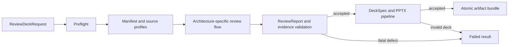
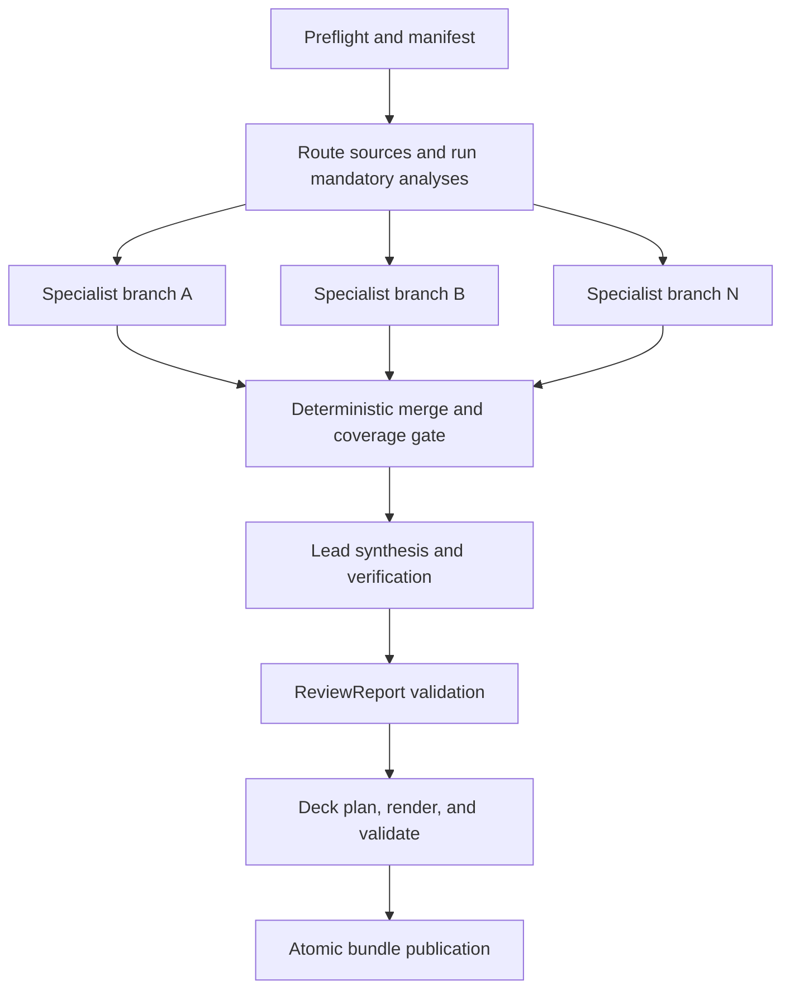
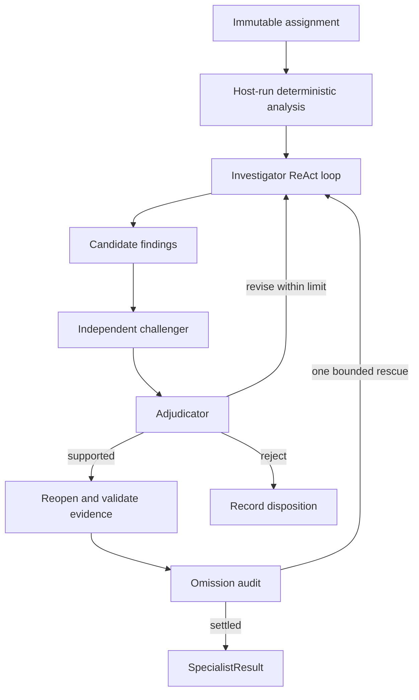
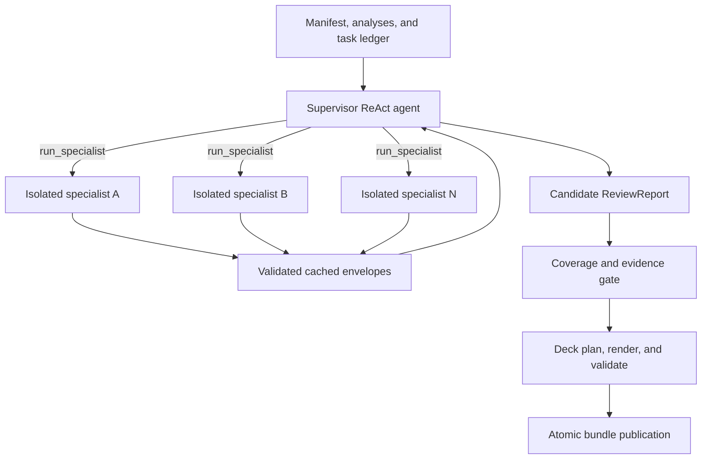
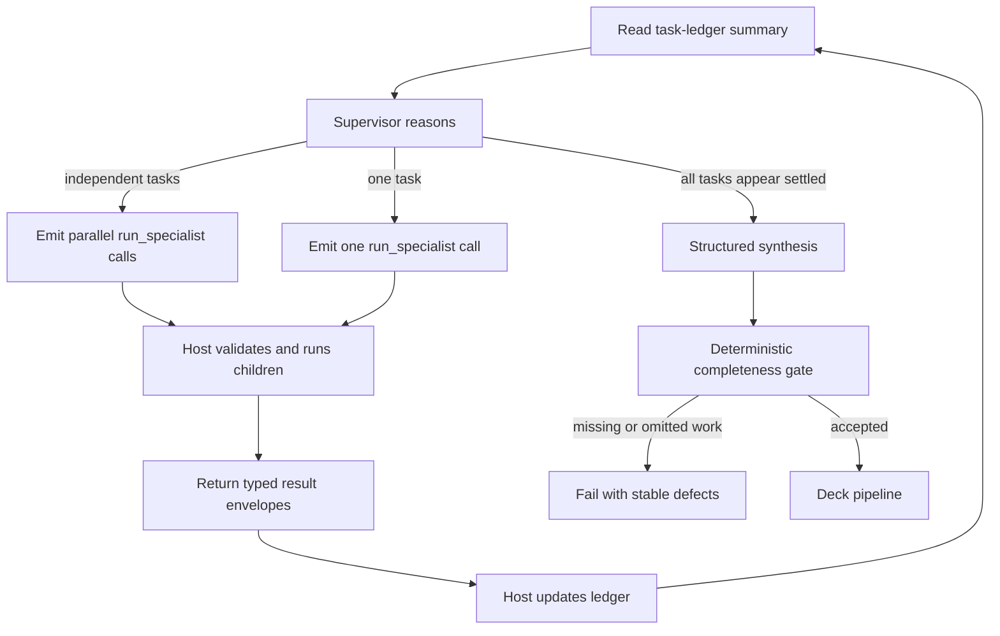
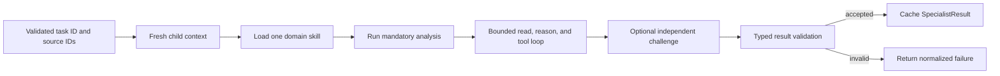
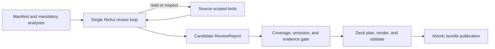
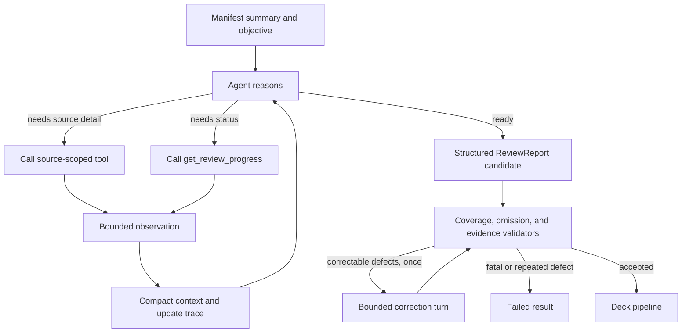

# Three implementation plans for data-source review and PowerPoint delivery

Status: proposed, architecture-neutral implementation plan

Date: 2026-09-23

## 1. Goal and decision boundary

Implement and evaluate three alternative agent architectures that accept a configured data
source, review its contents, and publish a validated PowerPoint review deck (`review.pptx`).
The alternatives are:

1. a static controlled graph with specialist agents;
2. a supervisor agent with specialist subagents; and
3. one general ReAct review agent.

This plan deliberately does not select an architecture and does not use the current review
implementation as a reason to rank one. Each alternative is treated as an independently
shippable product path and must satisfy the same input, evidence, presentation, and quality
contracts. Existing modules may be reused when they meet those contracts, but parity is
measured by observable outcomes rather than similarity to today's design.

The product outcome is not merely a model-written narrative. A successful run must:

- inventory and review every in-scope source;
- execute required deterministic analysis for the detected domains;
- retain traceable evidence for every material factual claim;
- disclose limitations and unresolved issues;
- generate a readable, evidence-backed PPTX; and
- validate both the review result and the rendered presentation before publication.

## 2. Common product contract

### 2.1 Request

All three implementations consume the same request model:

```python
class ReviewDeckRequest(BaseModel):
    source_root: Path
    output_dir: Path
    run_id: str
    review_period: DateRange | None = None
    audience: Literal["executive", "management", "analyst"] = "management"
    objective: str
    template_id: str = "standard-review"
    max_slides: int = 15
```

`source_root`, tool permissions, models, budgets, templates, and executable skills are host
configuration. Source content and model arguments cannot change them. The request may narrow
the review objective but cannot exempt a source from the manifest or disable validation.

### 2.2 Result and artifact bundle

Every implementation returns the same typed result and publishes the same logical bundle:

```text
<output_dir>/<run_id>/
  manifest.json              # immutable source identity, type, digest, and profile
  review.json                # typed findings, evidence, limitations, and coverage
  deck_spec.json             # presentation-neutral slide content and provenance
  review.pptx                # required user-facing deliverable
  review.pdf                 # optional render used for visual validation
  validation.json            # schema, evidence, PPTX, and rendering checks
  usage.json                 # calls, tokens, timings, retries, and architecture ID
  trace.jsonl                # append-only operational events
```

The public result includes `run_id`, `architecture`, `status`, artifact paths, warning and
failure codes, usage totals, and resume metadata. Terminal status is one of `completed`,
`completed_with_warnings`, or `failed`. `completed` and `completed_with_warnings` both require
a valid PPTX. A run that has a good narrative but no valid deck is failed.

### 2.3 Shared processing stages

These stages are required for every plan even when their orchestration differs:

1. **Preflight:** validate request containment, output isolation, template availability, and
   configured limits.
2. **Manifest:** discover supported sources, hash them, profile their structure, and assign
   stable source IDs.
3. **Domain routing:** map sources to one or more registered review skills; record a
   conservative fallback assignment for unknown content.
4. **Deterministic analysis:** run mandatory host-controlled checks and store receipts.
5. **Agent review:** inspect evidence, explain anomalies, seek counter-evidence, and propose
   typed findings.
6. **Evidence validation:** parse and reopen every retained locator against the manifest
   digest; reject unsupported claims.
7. **Synthesis:** organize accepted findings, limitations, and actions into a typed review.
8. **Deck planning:** transform only validated review data into `deck_spec.json`.
9. **PPTX generation:** render the deck spec through a deterministic presentation builder.
10. **Deck validation:** inspect package structure and render slides for programmatic and
    visual checks before atomic publication.

Agents can influence investigation and wording. They cannot directly write the PPTX, mark
coverage complete, admit evidence, change severity policy, or publish artifacts.

## 3. Shared foundation to build once

### 3.1 Source and evidence layer

Create a document-adapter registry that profiles and reopens CSV, XLSX/XLSM, Parquet, PDF,
DOCX, Markdown, and text. Each adapter must provide stable locator semantics, bounded reads,
digest verification, containment enforcement, and explicit corrupt/unsupported behavior.
Tabular adapters also expose bounded schema inspection, row reads, grouping, reconciliation,
and approved statistical operations through shared tool implementations.

Persist a coverage ledger keyed by source ID. Each source ends with exactly one disposition:
reviewed, reviewed with a disclosed limitation, or fatal failure. A source cannot disappear
because no agent selected it.

### 3.2 Typed review model

Use a presentation-independent model as the sole input to deck planning:

```python
class ReviewFinding(BaseModel):
    finding_id: str
    title: str
    summary: str
    severity: Literal["critical", "high", "medium", "low", "observation"]
    source_ids: list[str]
    evidence: list[EvidenceReference]
    impact: str
    recommendation: str | None
    limitations: list[str]

class ReviewReport(BaseModel):
    executive_summary: str
    scope: ScopeSummary
    findings: list[ReviewFinding]
    cross_source_observations: list[CrossSourceObservation]
    actions: list[Action]
    unresolved_items: list[UnresolvedItem]
    coverage: list[CoverageRecord]
```

Finding IDs and source IDs remain stable from review JSON through speaker notes so an
operator can trace a slide statement back to admitted evidence.

### 3.3 Presentation layer

Keep presentation creation deterministic and outside agent tool access:

```text
ReviewReport
    -> DeckPlanner (content selection and slide schema)
    -> DeckSpecValidator (provenance, limits, required sections)
    -> PptxRenderer (approved template and layout components)
    -> PackageValidator (OOXML/package and reopen checks)
    -> VisualValidator (rendered-slide inspection)
    -> atomic publish
```

`DeckSpec` should support title, executive summary, scope/method, KPI, finding, comparison,
action, limitation, and appendix slides. Each content block carries finding/evidence IDs;
the renderer places compact citations or source IDs on-slide and full provenance in speaker
notes. Charts are produced from deterministic series stored in the spec, never from an
agent-generated image. Tables are capped and paginated rather than scaled to illegibility.

The default narrative is:

1. title and run metadata;
2. executive summary and overall conclusion;
3. scope, source coverage, period, and methodology;
4. key metrics and trends, when applicable;
5. prioritized findings, one or more slides per material theme;
6. cross-source inconsistencies and control implications;
7. recommended actions, owners, and priority;
8. limitations and unresolved items; and
9. evidence appendix/source inventory.

The deck validator must check that required sections exist, slide and text limits are met,
every factual slide block has provenance, all referenced findings exist, the PPTX reopens,
and no temporary artifact was published. Render the PPTX to images or PDF in CI/integration
tests and check for overflow, clipping, overlap, unreadably small text, empty placeholders,
and low-contrast elements. A deterministic fallback layout is used when content does not fit;
silent clipping is forbidden.

### 3.4 Security, budgets, and persistence

- Agents receive read-only, source-scoped tools with bounded results.
- No agent receives arbitrary filesystem, process, Python, network, or presentation-writing
  capabilities.
- Source text is untrusted data and cannot add tools, change prompts, or waive gates.
- Apply per-run and per-agent limits for elapsed time, model calls, tool calls, tokens,
  retries, result size, and concurrency.
- Retry only classified transient provider/transport failures. Validation and integrity
  failures are not retryable.
- Use stable idempotency keys for analyses, specialist tasks, accepted findings, deck specs,
  and artifact publication.
- Persist enough state to resume without repeating accepted work or publishing duplicate
  decks. Recheck source digests before resume and before final publication.

### 3.5 How to read the three graphs

The diagrams use four kinds of flow:

- **Control flow** determines which component chooses the next operation. In Plan 1, graph
  edges do; in Plan 2, the supervisor chooses among pre-authorized tasks; in Plan 3, one
  agent chooses among read and analysis tools.
- **Data flow** moves immutable source IDs, analysis receipts, evidence references, findings,
  and report objects. Raw child transcripts and unrestricted paths never cross boundaries.
- **Validation flow** moves candidate output through deterministic gates. A validator can
  accept, request one bounded revision where allowed, or fail; it cannot silently repair a
  factual claim.
- **Persistence flow** writes stable checkpoints and idempotent result envelopes. Dashed
  conceptual return paths in the descriptions below represent resume or bounded revision,
  not an unbounded retry loop.

All three graphs have the same deterministic outer frame:



The architecture-specific box is the only part fundamentally changed by the three plans.
This distinction matters: “agent flow” describes how candidate findings are produced, while
the outer frame guarantees that no agent can publish a report or presentation by assertion.

The principal differences are:

- **Plan 1:** code-defined edges choose the next step; a specialist branch is the isolated
  unit; raw context stays in that branch; a deterministic reducer joins results; and named
  nodes and branches are the durable recovery units. Parallelism is explicit fan-out.
- **Plan 2:** the supervisor chooses from a fixed task ledger; a specialist invocation is the
  isolated unit; raw context stays in that child; typed envelopes return to the supervisor;
  and supervisor turns plus cached child tasks are the durable units. Independent
  `run_specialist` calls can execute in parallel.
- **Plan 3:** one agent chooses individual tool calls; all raw observations enter one bounded
  context; one structured response converges the work; and model/tool steps are the durable
  units. Parallelism exists only when the model emits parallel tool calls in one turn.
- **All plans:** deterministic coverage, evidence, presentation, and publication gates retain
  final authority.

## 4. Plan 1 — static controlled graph with specialist agents

### 4.1 Runtime design

Code owns the review stage order. A parent graph creates the manifest, routes source IDs,
fans out specialist branches, merges typed results, validates coverage/evidence, invokes a
bounded lead synthesizer, and calls the deterministic deck pipeline.



Each specialist branch runs its required deterministic analysis, a bounded investigator,
an independent challenger, adjudication/revision, and an omission audit. Branches see only
assigned source IDs and return `SpecialistResult`; they do not mutate shared results. A
stable reducer merges branch envelopes in assignment order and records contradictions.

#### 4.1.1 Parent graph flow

The parent is a workflow rather than a free-running agent. Its transitions are:

1. **Preflight and manifest:** code validates paths and limits, discovers sources, assigns
   stable IDs, hashes content, and persists the initial checkpoint.
2. **Route and analyze:** deterministic rules associate source IDs with registered domains.
   Mandatory domain analysis runs before model research and creates analysis receipts.
3. **Fan out:** the graph creates one branch per specialist assignment. Branches may run in
   parallel, but each receives an immutable assignment and a separate state namespace.
4. **Run branches:** each branch produces a typed `SpecialistResult` using the inner flow
   below. It cannot write parent state or publish artifacts.
5. **Reduce:** code orders results by stable assignment ID, verifies every expected branch is
   present, and records duplicate or contradictory findings instead of overwriting them.
6. **Gate coverage:** the coverage node checks every manifest source and mandatory analysis.
   Missing work routes to failure; it does not route back to arbitrary new research.
7. **Synthesize and verify:** a lead model receives validated envelopes, not raw sources. An
   independent verifier may request a bounded lead revision.
8. **Validate and publish:** deterministic report, evidence, deck, and bundle validators run
   before atomic publication.

#### 4.1.2 Specialist branch flow



The investigator alternates between reasoning and assigned-source tool calls until it
submits typed candidates or exhausts its budget. The challenger gets an independent context
and attempts to falsify material candidates. The adjudicator selects accept, revise, or
reject for each candidate. Accepted evidence is reopened by code against the source digest.
Finally, the omission audit compares candidate dispositions with deterministic analysis
outputs. Revision and rescue edges have explicit counters, so the branch always terminates.

#### 4.1.3 Failure and resume flow

A remote-model timeout may retry inside its node according to policy. A corrupt source,
changed digest, invalid evidence reference, missing branch, or exhausted fatal budget follows
the failure edge immediately. Checkpoints exist before fan-out, for each completed branch,
after reduction, and around publication. On resume, completed branch envelopes are reused and
only unsettled branches run again; publication uses a stable bundle ID.

### 4.2 Implementation increments

1. Define parent/specialist state schemas, node inputs/outputs, reducers, status codes, and
   checkpoint keys.
2. Implement preflight, manifest, assignment, deterministic-analysis, and coverage nodes.
3. Implement the generic specialist branch from a trusted specialist registry; add bounded
   investigator, challenger, adjudicator, and omission-audit nodes.
4. Add parallel fan-out with configured concurrency and an ordered, idempotent merge.
5. Implement lead synthesis over validated specialist envelopes only, followed by an
   independent lead verifier and bounded revision.
6. Add `ReviewReport` validation and the shared deck planning/rendering/validation nodes.
7. Attach exception-specific retries and timeouts, then test checkpoint resume at every
   node boundary and during parallel work.
8. Expose this implementation under architecture ID `static_graph`.

### 4.3 Plan-specific tests and completion criteria

- Reducer tests prove that parallel completion order cannot change or lose results.
- Routing tests prove every manifest source receives a branch assignment and disposition.
- Replay tests prove completed nodes and publication are idempotent.
- Fault injection covers a failed specialist, invalid evidence, deadline expiry, crash after
  deck rendering, and restart before publication.
- The plan is complete when a process can resume from every durable stage and publish one
  validated bundle without repeating settled analysis.

## 5. Plan 2 — supervisor with specialist subagents

### 5.1 Runtime design

A deterministic shell creates the manifest, mandatory task ledger, source assignments, and
analysis receipts. A supervisor ReAct agent receives the review objective, ledger summary,
and exactly one command tool, `run_specialist`. It delegates to registered specialists and
synthesizes their validated envelopes. The shell, not the supervisor, decides whether every
required task is settled and whether the deck may be published.



The tool accepts only a registered specialist, pre-created task ID, exact assigned source
IDs, and a bounded objective. The host rejects reassignment, unknown tasks, repeated settled
tasks, and budget violations. Calls with the same task ID return a cached accepted envelope.
Independent tool calls may run concurrently under one shared semaphore.

Each specialist gets a fresh context, one domain skill, assigned-source tools, fixed budgets,
and no delegation or publication tools. It returns findings, analysis receipts, evidence,
warnings, unresolved items, and usage—not its transcript. An optional independent specialist
challenger can be an internal child stage, but its result must be visible in the envelope.

#### 5.1.1 Supervisor control loop

Unlike Plan 1, code does not prescribe the order of specialist calls. It does prescribe the
complete task ledger and the only legal command:



On each supervisor turn, the model sees task status and previously accepted result summaries.
It may call one specialist, call several independent specialists in parallel, or synthesize
when it believes the ledger is complete. The host validates every call before execution. A
request cannot invent a task, substitute source IDs, or change the assigned specialist. After
children finish, the host—not supervisor prose—updates task state and returns bounded envelopes
as tool results. The loop ends at synthesis, its run budget, or a non-retryable failure.

The final completeness gate does not send the supervisor into an open-ended retry loop. If a
required task was never requested, the run fails with the missing task IDs. An implementation
may permit one schema-only repair for malformed synthesis, but it may not use that repair to
create absent specialist evidence.

#### 5.1.2 Specialist child flow



The child is not a persistent conversational peer. It is a request/response worker created
for one ledger task. The child can follow evidence within its assigned sources, but it cannot
call another child, alter the ledger, synthesize the final report, or render slides. Result
validation and evidence reopening occur before the envelope is cached or shown to the
supervisor.

#### 5.1.3 Concurrency, failure, and resume flow

When one supervisor message contains several valid calls, the host atomically reserves task
attempts and concurrency slots, runs children concurrently, and returns results in tool-call
order. One child failure does not erase successful siblings. The ledger records each task as
pending, running, completed, completed with warnings, or failed.

Supervisor checkpoints and child-result storage are separate. On replay, the stable task ID
finds the cached accepted envelope rather than rerunning the child. A timed-out or interrupted
task can run again only when policy marks its previous attempt retryable; a validation or source
integrity failure is final.

### 5.2 Implementation increments

1. Define `SpecialistSpec`, `SpecialistTask`, `SpecialistResult`, the authoritative task
   ledger, and stable task-ID generation.
2. Build the guarded `run_specialist` adapter with atomic admission, concurrency control,
   timeout/cancellation cleanup, output bounds, caching, and normalized errors.
3. Implement isolated specialist construction from host-selected model, skill, tool subset,
   and source scope; add result schema and evidence validation before cache admission.
4. Implement the supervisor prompt and structured response. Require it to reconcile all
   result envelopes and preserve disagreements and warnings.
5. Add a deterministic post-supervisor gate that rejects missing tasks, sources, analysis
   receipts, evidence, or result-envelope findings omitted without a disposition.
6. Integrate the shared deck pipeline only after that gate accepts `ReviewReport`.
7. Persist supervisor checkpoints, ledger state, and child envelopes in separate namespaces;
   test replay of the model turn that initiated parallel child calls.
8. Expose this implementation under architecture ID `supervisor_subagents`.

### 5.3 Plan-specific tests and completion criteria

- Admission tests reject invented specialists, changed source sets, nested delegation, and
  duplicate or over-budget calls.
- Isolation tests prove that one specialist cannot read another specialist's sources.
- Replay tests prove a repeated supervisor turn reuses accepted task envelopes.
- Fault injection covers partial parallel failure, cancellation, conflicting specialists,
  supervisor omission, malformed child output, and child timeout.
- The plan is complete when the supervisor may choose task order and concurrency, while code
  still proves every mandatory task and source is settled before one validated deck is
  published.

## 6. Plan 3 — one general ReAct review agent

### 6.1 Runtime design

One ReAct agent receives the immutable manifest, review objective, coverage summary, and a
bounded catalog of source-reading and deterministic-analysis-result tools. Before the loop,
the host runs every mandatory analysis and records receipts. The agent chooses its research
path and produces a structured candidate `ReviewReport`; external gates validate coverage,
evidence, and the deck.



The loop receives compact manifest entries and fetches source content on demand. A
`get_review_progress` tool exposes uncovered sources, unread analysis receipts, unresolved
candidate findings, and remaining budget without allowing the agent to edit the ledger.
Middleware enforces model/tool limits, total duration, context compaction, retry policy, and
structured-output repair. The agent has no subagents and no artifact-writing tool.

Because there is no independent specialist boundary, this plan adds a deterministic omission
audit after the loop. The audit compares the candidate report with source coverage, mandatory
analysis candidates, and evidence records. Policy may allow one bounded correction turn that
receives only explicit validation defects. Remaining fatal defects fail the run; permitted
uncertainties become disclosed warnings.

#### 6.1.1 Single-agent control loop



The same model performs planning, investigation, and synthesis in one conversation. Each turn
either emits tool calls or attempts the structured final response. Source tools return bounded
observations; they also update host-owned trace and coverage records. `get_review_progress`
reports what remains uncovered, but the agent cannot modify that status directly. Context
compaction preserves the manifest, analysis receipts, accepted evidence IDs, unresolved items,
and remaining budget while summarizing older non-authoritative observations.

The agent stops when it returns a schema-valid candidate, reaches a call/time/recursion limit,
or hits a fatal tool/integrity error. Stopping is not completion: the external validators still
decide whether the report is publishable.

#### 6.1.2 Validation and correction flow

The post-loop audit checks four independent ledgers: source disposition, required analysis
receipts, deterministic candidate disposition, and retained evidence. Correctable defects are
limited to representation problems such as a missing disposition already supported by recorded
evidence. The one correction turn receives typed defect codes and existing accepted facts; it
does not receive a fresh research budget. Missing evidence, unread sources, digest changes, or
budget exhaustion cannot be repaired through prose and therefore fail or become an explicitly
policy-allowed warning.

#### 6.1.3 Failure and resume flow

The durable unit is a model or tool step rather than a semantic specialist stage. Tool calls use
stable IDs so replay can reuse successful observations after an uncertain model/transport
failure. Resume restores the compacted conversation, host-owned ledgers, remaining budgets, and
accepted evidence. Because all research shares one context, there is no branch-level restart or
isolated partial specialist result to recover.

### 6.2 Implementation increments

1. Build the manifest summary, mandatory-analysis receipt store, global coverage ledger, and
   source-scoped tool catalog for the complete review.
2. Add `get_review_progress` and ensure all read/analysis calls update observations without
   letting model output declare completion.
3. Construct the ReAct agent with structured `ReviewReport` output, context compaction, hard
   budgets, transient retries, and a persistent run checkpoint.
4. Implement post-loop coverage, mandatory-candidate disposition, evidence, severity, and
   internal-consistency validation.
5. Add one optional correction turn with a fresh bounded budget and a typed defect list;
   reject repeated repair loops.
6. Integrate the shared deck pipeline after the corrected report passes all gates.
7. Test recovery from checkpoints at model/tool boundaries and define how tool calls are
   deduplicated after uncertain transport outcomes.
8. Expose this implementation under architecture ID `single_react`.

### 6.3 Plan-specific tests and completion criteria

- Trajectory tests cover different tool orders while requiring the same settled coverage.
- Context tests cover many heterogeneous and oversized sources without silently losing
  manifest entries or accepted findings.
- Omission tests prove skipped sources and undisposed deterministic candidates cannot reach
  publication.
- Fault injection covers a looping agent, malformed structured output, budget exhaustion,
  prompt injection in a source, and failure during the single correction turn.
- The plan is complete when varied valid trajectories can produce a validated deck and every
  incomplete trajectory ends with a stable failure or warning rather than an unchecked PPTX.

## 7. Suggested module boundaries

The paths below describe ownership rather than requiring a rewrite of working components:

```text
data_agent/review/
  contracts.py                 # shared request, result, status, and warning models
  manifest.py                  # immutable source inventory and coverage ledger
  adapters/                    # format profile and evidence reopen registry
  evidence.py                  # locator parsing, admission, and digest checks
  report_models.py             # ReviewReport and finding contracts
  architectures/
    static_graph.py            # Plan 1 composition
    supervisor.py              # Plan 2 composition and task ledger
    single_react.py            # Plan 3 composition and progress surface
  specialists/                 # shared specialist specs and isolated runner
  presentation/
    models.py                  # DeckSpec and slide/block schemas
    planner.py                 # ReviewReport -> DeckSpec
    renderer.py                # template-based PPTX generation
    validator.py               # package, provenance, and visual checks
    templates/                 # versioned approved presentation assets
  publication.py              # atomic bundle publication
  service.py                  # architecture selection and common public interface
```

Shared read/analysis implementations remain under `data_agent/tools`, skill discovery and
registration under `data_agent/skills`, and model adapters under `data_agent/llm`. Architecture
modules compose those capabilities; they do not create private copies.

## 8. Delivery sequence

### Phase A — contracts and golden synthetic corpus

- Freeze request/result, manifest, evidence, review report, deck spec, and validation schemas.
- Create small synthetic CSV/document combinations with known anomalies and safe expected
  assertions; keep evaluation gold material out of unit tests.
- Define status/failure codes and architecture-independent telemetry.

**Exit:** schemas round-trip, fixture manifests are deterministic, and expected deck sections
can be asserted without invoking a model.

### Phase B — shared ingestion, evidence, and PPTX pipeline

- Implement adapters, coverage ledger, deterministic analysis receipts, and evidence reopen.
- Implement the template, deck planner, PPTX renderer, speaker-note provenance, atomic writes,
  package checks, and rendered-slide validation.
- Generate a deck from a hand-authored valid `ReviewReport` before connecting any agent.

**Exit:** the same report deterministically creates a reopenable and visually accepted PPTX.

### Phase C — three vertical slices

Implement a minimal end-to-end slice for each architecture using the same single domain and
fixture. Do not tune one plan with knowledge unavailable to the others. Each slice must
produce the complete artifact bundle and expose its architecture ID and usage.

**Exit:** all three produce a deck for the simple fixture and fail the same invalid-evidence
fixture.

### Phase D — production behavior per plan

Complete the increments and fault tests in Sections 4–6. Add all registered domains,
heterogeneous sources, parallelism where applicable, checkpoint/resume, and full budgets.

**Exit:** each plan independently meets its plan-specific completion criteria and the common
acceptance suite.

### Phase E — neutral benchmark and decision record

Run the same controlled cases with pinned source snapshots, prompts, model versions, template,
budgets, concurrency, and repeat count. Report correctness before latency or cost and retain
raw machine-readable metrics. Publish a separate architecture decision record only after the
results are reviewed; do not encode a winner in this implementation plan.

## 9. Common test matrix and acceptance gates

Test all plans against:

- one simple table, multiple related tables, mixed table/document sources, empty sources,
  corrupt files, unsupported formats, changed files, oversized files, and adversarial text;
- clear anomalies, benign exceptions, cross-source contradictions, no-findings cases, and
  ambiguous evidence;
- provider timeout/rate limit, tool failure, structured-output failure, process termination,
  resume, and publication failure; and
- short and long deck content, dense tables, long titles, missing optional charts, many
  citations, and warning-heavy reviews.

For every successful run require:

1. 100% manifest disposition and mandatory-analysis receipt coverage.
2. Every material claim and chart traceable to digest-bound evidence or a clearly labeled
   analytical observation.
3. No fatal validator defect and no undisclosed unresolved item.
4. A schema-valid `deck_spec.json` consistent with `review.json`.
5. A PPTX that reopens, renders, contains every required section, and passes layout checks.
6. Matching finding/source IDs in review JSON, deck spec, slides/notes, and validation output.
7. Atomic publication of one complete bundle and successful bundle reload.
8. Accurate status and usage records, including on resume and injected failure.

Compare architectures using source coverage, supported-claim precision, material-finding
recall, deterministic-candidate disposition, deck completeness, visual defect count, output
variance, resume duplication, model/tool calls, tokens, elapsed time, peak concurrency,
retries, and total implementation/operational complexity. A cheaper or faster run that fails
an acceptance gate is a failure, not a favorable benchmark result.

## 10. Definition of done

An implementation plan is done only when its architecture:

- runs through the common service contract without a human interrupt;
- reviews all provided in-scope data sources under enforced read-only containment;
- produces a validated `ReviewReport`, `DeckSpec`, and `review.pptx`;
- preserves evidence and slide provenance across checkpoint/resume;
- terminates predictably under configured budgets and injected faults;
- passes the shared and plan-specific test suites; and
- can be benchmarked against the other two plans with no architecture-specific relaxation of
  correctness, evidence, or presentation-quality gates.
