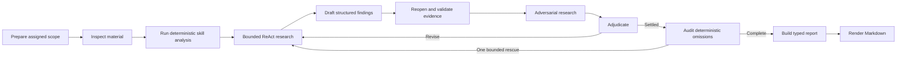
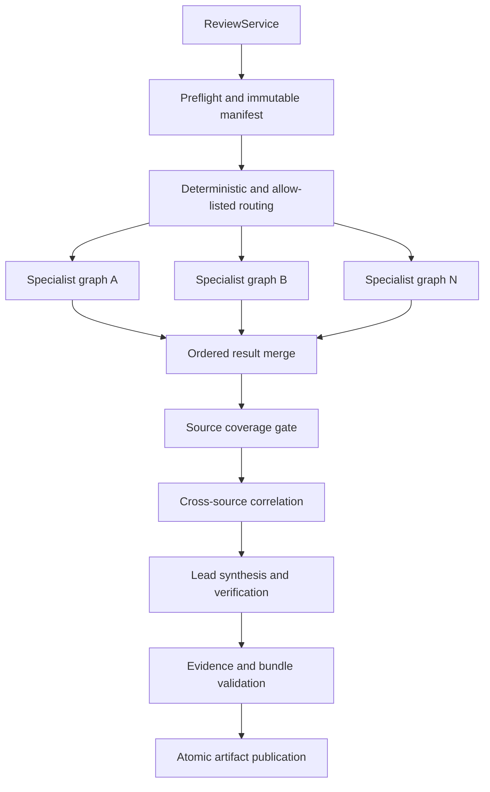
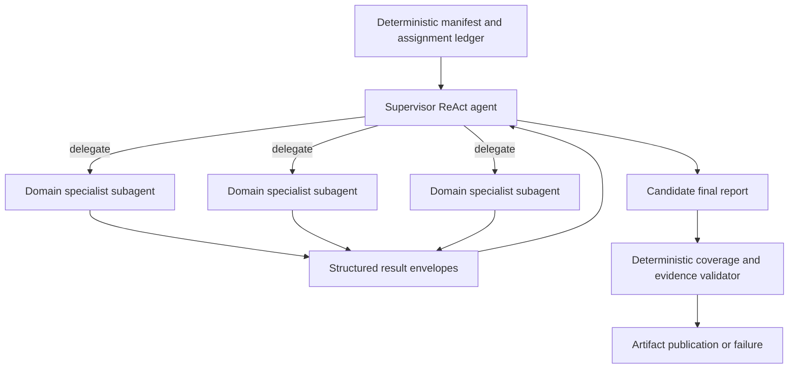
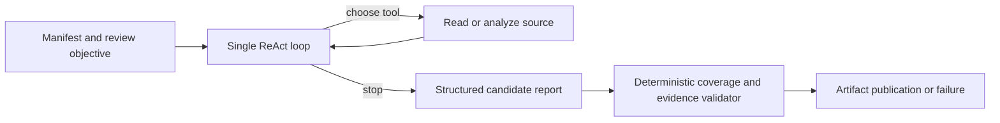

# Review service architecture options

Status: architecture recommendation

Date: 2026-09-22

Decision priority: auditability and correctness for unattended runs

## Executive decision

Keep the review service as a controlled LangGraph workflow under `data_agent/review`,
with bounded ReAct agents inside specialist research steps. Do not replace the review
coordinator with either a model-directed supervisor or one general ReAct agent.

The repository has already completed the package-level move: there is no top-level
`review/` package, and the public interface, orchestration, domain models, ingestion,
verification, reporting, and run persistence all live under
[`data_agent/review`](../../data_agent/review). The remaining work is to deepen that
module, make document support extensible, and harden autonomous execution.

The recommended design is a hybrid:

- Code controls source discovery, coverage, stage order, budgets, evidence reopening,
  verification, checkpointing, terminal status, and artifact publication.
- Domain skills own deterministic analysis and review guidance.
- Bounded ReAct loops investigate assigned sources and test alternative explanations.
- Model output is always treated as a candidate result until deterministic gates accept it.

This recommendation fits the nature of a review. A valid result depends on proving that
every source received a disposition and that every retained claim can be traced back to
reopenable evidence. Those are workflow invariants, not decisions that should depend on a
model remembering to perform them.

## Question, scope, and method

This research compares three standalone designs:

1. A static controlled LangGraph workflow.
2. A supervisor that delegates to specialist subagents.
3. One standard LangChain ReAct agent.

All three designs must run without human intervention. An ambiguous or unsupported input
must become a recorded limitation, warning, or failure rather than an interrupt asking a
person what to do.

The initial document scope is the set already represented by
[`SourceType`](../../data_agent/review/domain/source.py): CSV, XLSX, XLSM, Parquet, PDF,
DOCX, Markdown, and text. Scanned documents, images, PPTX, email, and other formats are
future adapters. The shared source tools can discover JSON and YAML, but the review domain
does not currently model or reopen them as review evidence; discovery support alone does
not make a format review-supported.

The comparison uses repository code and tests for the current-state assessment and
official LangChain/LangGraph documentation and source for framework behavior. Runtime and
cost conclusions are engineering estimates. They have not yet been measured on a common
evaluation corpus.

## Current implementation baseline

[`ReviewService`](../../data_agent/review/service.py) is already the deep external module.
Its interface is small: `start`, `resume`, and `status`. It persists authoritative run
inputs, gives each run a checkpoint thread keyed by `run_id`, returns typed results, and
exposes traces without requiring callers to understand graph state.

The parent graph is a predetermined workflow. It builds a complete source manifest,
classifies sources into registered review domains, fans specialist work out with
LangGraph `Send`, blocks synthesis until the coverage ledger is settled, correlates
specialist findings, verifies the lead report, and writes final artifacts. LangGraph
distinguishes workflows, which follow predetermined code paths, from agents, which choose
their own processes and tool use. Its orchestrator-worker pattern uses `Send` to create
workers with separate state and collect their outputs in shared state. This matches the
current parent graph closely. See the official
[workflow and agent patterns](https://docs.langchain.com/oss/python/langgraph/workflows-agents).

Each specialist is also a controlled graph:



The separate conversational delegation work under
[`data_agent/agent/subagents`](../../data_agent/agent/subagents) has a different purpose.
It gives the chat agent one level of tool-mediated delegation with isolated child context
and bounded execution. Its children are deliberately stateless and do not own review
coverage, evidence admission, or durable specialist checkpoints. That module can supply
useful contracts and budget mechanisms, but it should not replace the review orchestrator
unchanged. The current conversational design is documented in
[`docs/subagents.md`](../subagents.md).

The implementation already has several strong unattended-run properties:

- Unsupported or corrupt sources fail preflight instead of disappearing from the review.
- Unclassified sources are conservatively assigned to all registered specialists.
- Specialists receive an explicit source subset and read-only source tools.
- Source hashes and `source://` locators allow evidence to be reopened and checked.
- Research, adversarial review, revision, and omission rescue have explicit bounds.
- Specialist branches isolate results before a deterministic merge.
- Completed bundles are validated before downstream use.
- SQLite checkpoints support local standalone resume, while JSONL traces and usage records
  make a run inspectable.

The current bounded specialist defaults are intentionally finite: initial/revision
research allows 12/6 agent cycles and 24/12 tool calls; adversarial work allows 6/3 cycles
and 8/4 tool calls; verifier rounds are limited to two; omission rescue is limited to one.
These controls constrain inner agent loops, although the parent graph does not yet attach
explicit retry policies or deadlines to its nodes.

The important remaining gaps are:

- Format handling is split between shared source discovery and review-specific catalog and
  evidence readers. Adding a format requires coordinated edits rather than one adapter.
- The public status model has `running`, `completed`, `failed`, and `not_found`, but no
  distinct successful state for a fully covered review with disclosed unresolved items.
- Parent and specialist nodes do not declare exception-specific retry or timeout policies,
  even though the installed LangGraph 1.2.11 `StateGraph.add_node` supports both.
- Specialist artifacts use atomic replacement, while final report artifacts are currently
  written directly.
- SQLite is appropriate for a single standalone process, but it should not be treated as a
  multi-host production checkpoint store.

## Common contract for every option

A fair comparison requires every design to meet the same contract. Removing a gate from
an agent design would make that design faster by changing the product rather than by
solving the same problem more efficiently.

### External interface

Preserve `ReviewService.start(request)`, `resume(run_dir)`, and `status(run_dir)`. Preserve
the current required request data: source root, output directory, run ID, inclusive review
period, and desk context. Callers should not know which orchestration design is selected.

Add one terminal value to both public and persisted status contracts:

- `completed`: every required source and evidence check settled with no unresolved material
  limitation.
- `completed_with_warnings`: coverage is complete, but the final report discloses bounded
  uncertainty, unavailable non-critical analysis, or unresolved findings.
- `failed`: the service cannot establish source integrity, complete mandatory coverage,
  validate retained evidence, or publish a coherent artifact bundle.

Warnings and failures should also carry stable machine-readable codes. Free-form reasons
remain useful to operators but should not be the only way an automated caller identifies
`unsupported_format`, `parse_failed`, `source_changed`, `budget_exhausted`,
`coverage_incomplete`, `evidence_invalid`, or `provider_unavailable`.

### Document adapter seam

Create one internal interface for format-specific behavior. This is an internal seam;
`ReviewService` remains the external interface.

```python
class DocumentAdapter(Protocol):
    source_types: frozenset[SourceType]

    def profile(self, path: Path, *, relative_path: str) -> DocumentProfile: ...

    def reopen(
        self,
        path: Path,
        locator: Locator,
        *,
        limits: ReadLimits,
    ) -> EvidenceSnippet: ...
```

`profile` returns deterministic metadata needed by routing and validation: size, digest,
row/sheet/page/paragraph counts, column names, date range when derivable, parse errors, and
format limitations. `reopen` accepts a parsed typed locator and returns a bounded snippet.
Every reopen checks source containment and the manifest digest before reading.

The registry resolves a suffix and validated content type to exactly one adapter. CSV,
Excel, Parquet, PDF, DOCX, and text-like adapters are the initial implementations. A new
format is complete only when it has:

1. deterministic profiling;
2. stable locator semantics;
3. bounded evidence reopening;
4. containment and digest validation;
5. parse-error and unsupported-feature behavior;
6. fixtures for successful, corrupt, changed, oversized, and out-of-range inputs.

The adapter does not own domain interpretation. Domain-specific computations remain in
top-level skills, and specialist registration remains in `data_agent/skills`. This keeps
format changes local while allowing the same document to be reviewed by more than one
domain skill.

### Autonomous execution rules

Every option must enforce these rules outside model prose:

- Build an immutable manifest before analysis and account for every source at finalization.
- Give models only guarded, read-only source tools; no arbitrary filesystem, process,
  Python, or network access.
- Treat document text and tool results as untrusted data that cannot grant capabilities or
  change system policy.
- Bound run duration, model calls, tool calls, result size, retries, and concurrency.
- Retry transient provider and transport failures only. Validation errors, integrity
  changes, and deterministic policy failures are not retryable.
- Use one persistent checkpoint thread per run and idempotent node behavior on replay.
- Write every externally visible artifact to a temporary sibling and publish it with
  atomic replacement.
- Validate the complete artifact bundle before returning a successful status.
- Never use a human interrupt. Record uncertainty and continue when policy allows it;
  otherwise fail with a stable reason.

LangGraph checkpointers persist thread-scoped graph snapshots and use a `thread_id` to
recover state, which is the correct model for a resumable review run. See
[LangGraph persistence](https://docs.langchain.com/oss/python/langgraph/persistence).

## Tool and skill capability model

Tools, skills, and document adapters have separate responsibilities:

- A **tool** performs one bounded operation with typed inputs and a bounded result. Shared
  implementations belong in `data_agent/tools`; MCP and in-process LangChain wrappers are
  adapters over those implementations.
- A **skill** is a trusted, version-controlled domain playbook. Review skills also declare
  a deterministic Python analysis entrypoint and verifier policy. A skill is not an agent
  and does not grant capabilities by itself.
- A **document adapter** profiles and reopens one file format. It does not decide what the
  document means or which review conclusion to draw.

This separation prevents every agent from receiving every capability and prevents format
logic, domain policy, and orchestration from being recreated under individual callers.

### Current shared tool catalogs

The general conversational agent loads the MCP catalog registered by
[`data_agent/mcp_server/server.py`](../../data_agent/mcp_server/server.py). It includes
general source-reading, tabular, statistical, context-inspection, workspace-search,
example, and restricted-Python tool groups. That broad catalog is appropriate for an
interactive assistant whose task is not known at startup. It is too broad for an
unattended review specialist.

When conversational delegation is enabled, a child receives only the `tool_names` and
`skill_names` declared by its trusted `SubagentSpec`. The built-in `research` child has no
skills and receives six read-only tools:

- `list_sources`
- `search_text`
- `read_lines`
- `read_document_section`
- `inspect_table`
- `read_rows`

It cannot receive `run_subagent`, and it cannot receive the root `load_skill` tool. A
selected skill is compiled into the child's tool set by the host, so the child cannot load
an unregistered skill at runtime. The current conversational child is scoped to the
configured source root, but named paths in its task are guidance rather than a separate
file-level authorization boundary.

Controlled review specialists use a stricter in-process catalog constructed by
[`build_research_tools`](../../data_agent/tools/research.py). Every path-bearing call is
checked against that specialist's assigned source paths, every call is recorded in the
research trace, results are bounded, and a per-round call budget is enforced. The current
catalog is:

| Tool group | Assigned-source tools | Purpose |
| --- | --- | --- |
| Inventory | `list_assigned_sources` | Show the immutable manifest entries assigned to the specialist. |
| Table reading | `inspect_table`, `read_rows`, `describe_columns` | Inspect schema, samples, and exact row ranges. |
| Table analysis | `group_by`, `join_tables`, `run_duckdb_query` | Perform bounded deterministic aggregation and reconciliation. |
| Text/document reading | `search_text`, `read_lines`, `reopen_evidence` | Find and reopen exact text, paragraph, page, or row evidence. |
| Statistics | `zscore`, `outlier_detection`, `change_point_candidates`, `pearson_correlation` | Test bounded numerical leads without asking the model to calculate them. |

The review catalog deliberately excludes workspace grep, arbitrary Python, process or
network access, artifact-writing tools, general skill loading, and delegation. The same
shared implementations back MCP and review use, but the review wrappers add assignment,
trace, and budget controls.

### Current specialized review skills

The specialist registry discovers trusted review skills from top-level `skills/`, validates
their metadata and contained entrypoints, and builds the same generic specialist graph for
each definition. The deterministic entrypoint runs before ReAct research; the model cannot
skip it or substitute a prose calculation.

| Skill | Owned source domains | Specialized deterministic responsibility |
| --- | --- | --- |
| `risk-metrics` | `risk_metrics` | Analyze risk consumption, limits, metric behavior, workflow data, and cross-source consistency. |
| `pnl` | `pnl`, `income_attribution`, `pnl_adjustments`, `pnl_validation` | Reconcile PnL, attribution, adjustments, and validation history as one composite review. |
| `post-trade-controls` | `post_trade_controls` | Analyze breaches, approvals, remediation, recurrence, ownership, and workflow timeliness. |
| `risk-commentary` | `risk_commentary` | Analyze commentary coverage, internal consistency, repeated explanations, and validation gaps. |
| `lead-review` | Verified specialist reports rather than raw sources | Build deterministic cross-specialist clusters and contradiction candidates for final synthesis. |

Each specialist skill supplies instructions, dataset guidance when present, a verifier
policy, and an `analysis_entrypoint`. The host converts it into a `SpecialistSpec` with an
`analyses_runner`; it is not exposed as an arbitrary MCP function. `lead-review` is kept
separate because it consumes validated specialist reports and must not reread raw sources.

### Capability assignment by agent

The following assignments are the target for the three architecture options. “Host-only”
means deterministic code invokes the capability; the model does not see it as a tool.

| Agent or module | Command tools | Skills and specialized capability | Explicit exclusions |
| --- | --- | --- | --- |
| Deterministic review shell | Host-only catalog, adapter, routing, checkpoint, coverage, evidence, and artifact operations | All skill metadata for validation and assignment | No ReAct tool selection and no model-controlled policy |
| Static-graph specialist analyst | Assigned-source research catalog | Exactly one domain skill; its deterministic entrypoint is host-run before research | No delegation, dynamic skill loading, arbitrary Python, network, or writes |
| Static-graph adversarial challenger | Assigned-source evidence and analysis tools under the smaller adversarial budget | The same skill's verifier policy | No artifact publication or source assignment changes |
| Option 2 supervisor | `run_specialist` only | `lead-review` guidance and typed specialist-result schemas | No raw-source, analysis, filesystem, Python, or write tools |
| Option 2 specialist analyst | Assigned-source research catalog | Exactly one registered domain skill and its mandatory host-run analysis | No other domain skills and no child delegation |
| Option 2 specialist challenger | Evidence-reopening and relevant deterministic table/statistical subset | The assigned domain's verifier policy | No synthesis, publication, or assignment changes |
| Option 3 single ReAct agent | Assigned-source research catalog covering the complete manifest | Bounded views of every mandatory host-run domain analysis | No delegation, arbitrary Python, network, or direct artifact writes |
| Lead synthesizer | No raw-source tools; receives typed verified reports, clusters, contradictions, and limitations | `lead-review` | No new raw evidence, new specialist claims, or unsupported severity increases |

The supervisor in Option 2 should coordinate domain specialists rather than format
specialists. CSV, Excel, PDF, DOCX, and other format differences belong behind document
adapters. A domain specialist can then reconcile evidence across formats without creating
separate agents whose outputs must be joined merely because their files have different
extensions.

### Option 2 command and result contracts

The supervisor should see one command tool:

```python
async def run_specialist(
    specialist_name: str,
    task_id: str,
    source_ids: list[str],
    objective: str,
) -> SpecialistResult: ...
```

The deterministic shell creates the authoritative assignment ledger before the supervisor
runs. `run_specialist` accepts only an existing task, requires the registered specialist
and exact assigned source IDs, and uses `task_id` as the idempotency key. It rejects a
model attempt to add sources, change specialists, repeat a completed task, or exceed the
run budget.

Behind this command, the host performs the mandatory domain analysis, builds tools bound
to the assigned paths, loads exactly one domain skill, runs the analyst and challenger
within their budgets, and validates the typed result. The child returns an envelope rather
than its transcript:

```python
class SpecialistResult(BaseModel):
    task_id: str
    specialist_name: str
    source_ids: list[str]
    status: Literal["completed", "completed_with_warnings", "failed"]
    analysis_receipts: list[AnalysisReceipt]
    findings: list[Finding]
    unresolved_items: list[str]
    evidence_index: list[EvidenceReference]
    warnings: list[ReviewWarning]
    model_calls: int
    tool_calls: int
```

The supervisor receives only validated envelopes and synthesizes with `lead-review`. It
cannot mark a task complete, edit an analysis receipt, or waive a child failure. The
deterministic shell compares returned envelopes with the assignment ledger and reruns
evidence validation before accepting the supervisor's final structured report.

## Option 1: static controlled graph

### Design

Retain the current two-level graph and deepen its interfaces:



The parent state owns the manifest, review assignments, coverage ledger, specialist result
envelopes, lead-verification history, run budgets, warnings, and terminal status. It does
not carry live clients or adapter instances. Runtime dependencies are injected through
configuration.

Each specialist is built from one trusted `SpecialistSpec`: identity, domain guidance,
allowed source set, deterministic analysis entrypoint, and bounded settings. A specialist
may use a ReAct loop only to investigate assigned evidence. It cannot decide that another
source does not need review, publish final artifacts, or mark the run successful.

Attach policies according to failure semantics:

- Parser, evidence, coverage, reducer, and artifact validation nodes: no automatic retry.
- Model and remote transport nodes: exponential backoff with jitter for explicitly
  classified transient exceptions.
- Every asynchronous remote node: a per-attempt timeout.
- Parent run: a total deadline and shared call/token ledger checked before each model call.

The installed `StateGraph.add_node` exposes `retry_policy`, `error_handler`, and `timeout`;
LangGraph's `RetryPolicy` controls attempt count, exponential backoff, jitter, and the
exception predicate. The corresponding upstream definitions are in the official
[`StateGraph` source](https://github.com/langchain-ai/langgraph/blob/main/libs/langgraph/langgraph/graph/state.py)
and [`RetryPolicy` source](https://github.com/langchain-ai/langgraph/blob/main/libs/langgraph/langgraph/types.py).
Version-sensitive behavior must be verified against the repository lock before adoption.

### Advantages

- Strongest control over stage order, source coverage, evidence admission, and terminal
  status.
- Best audit trail because each material transition is a named node with typed state.
- Most predictable upper bounds on model work.
- Natural checkpoint and resume behavior at meaningful review stages.
- Independent specialist branches can execute concurrently while merging deterministically.
- Tests can exercise the same `ReviewService` interface used by production callers.
- A model can make a poor analytical suggestion without bypassing the evidence and omission
  gates.

### Costs and risks

- Highest up-front work for state schemas, routing, reducers, idempotency, and failure
  semantics.
- A fixed graph can miss a novel analytical path unless a bounded research node or new
  skill provides it.
- Incorrect reducers can duplicate or discard parallel branch results.
- Replayed nodes can duplicate model calls or artifacts if side effects are not idempotent.
- Adding a new review domain requires a registered skill, deterministic checks, report
  policy, and tests rather than only a new prompt.

### Runtime profile

The fixed stages create baseline work even for easy reviews, so this is unlikely to have
the lowest best-case latency. It has the narrowest variance because the number of loops and
verification rounds is bounded. Specialist `Send` branches reduce wall time to roughly the
slowest branch plus serial ingestion, merge, and synthesis, subject to a configured
concurrency limit. Checkpoints prevent a process restart from necessarily repeating all
completed parent work.

## Option 2: supervisor with specialist subagents

### Design

Use one supervisor ReAct agent with a fixed registry of specialist agents. Each specialist
has isolated instructions, an explicit source subset, a small tool set, a call budget, and
a required `SpecialistResult` schema. The supervisor receives result envelopes rather than
child transcripts and synthesizes the final report.



The supervisor receives only the `run_specialist` command defined in the capability model
above. The host, rather than the model, resolves source IDs to guarded tools. The model
cannot provide prompts, credentials, filesystem roots, model names, budgets, executable
tool definitions, or new source assignments. The host validates the specialist and task,
reserves a run slot atomically, applies a timeout, and returns a bounded status envelope.

LangChain's documented subagent pattern centralizes routing in a main agent, exposes
subagents as tools, and allows the main agent to invoke several in one turn. See
[LangChain subagents](https://docs.langchain.com/oss/python/langchain/multi-agent/subagents).
The documentation also states that `langgraph-supervisor` is no longer actively
maintained, so this option should use the tool-based subagent pattern or explicit graph
nodes rather than adopting that package.

For this review system, durable children should be explicit graph nodes or subgraphs with
stable names. Tool-wrapped subgraphs cannot be statically discovered for nested state
inspection. A subgraph compiled with `checkpointer=False` cannot resume after a crash;
per-thread child persistence conflicts with parallel calls to the same subgraph. The
official [subgraph persistence guide](https://docs.langchain.com/oss/python/langgraph/use-subgraphs)
documents these modes and constraints.

The deterministic assignment ledger and final validator remain mandatory. If the
supervisor omits a required delegation, the run fails `coverage_incomplete`; supervisor
prose cannot waive the assignment. Thus, a production-safe subagent solution still needs
a controlled shell around the agent hierarchy.

### Advantages

- Strong prompt and context isolation between specialties.
- A new specialty can often be added through a trusted registry entry and result schema.
- Parallel child calls can reduce wall time for independent work.
- Specialist agents can use different models and tool subsets without expanding one
  prompt or tool catalog.
- The supervisor can adapt the investigation plan when source composition is not known in
  advance.

### Costs and risks

- Two probabilistic layers affect the result: supervisor delegation/synthesis and child
  investigation.
- The supervisor can skip a source, choose the wrong specialist, repeat work, or omit a
  child's finding during synthesis.
- Child conclusions can conflict, requiring deterministic conflict recording or another
  model pass.
- Supervisor planning and repeated child summaries add model calls and tokens.
- Cancellation, concurrency, shared budgets, and checkpoint namespaces are more complex
  than the tool wrapper suggests.
- Tool-wrapped child state is harder to inspect and recover.
- Replaying a supervisor turn can repeat completed child work unless requests have stable
  idempotency keys and cached result envelopes.

### Runtime profile

Independent child runs can execute concurrently, but total work usually exceeds the
static design because a supervisor plans, delegates, reads every result, and synthesizes.
Context isolation can offset some token cost when each specialist sees only relevant
sources. Latency and cost vary with the supervisor's delegation choices, so strict child,
run, and concurrency limits are necessary.

## Option 3: one standard ReAct agent

### Design

Create one `langchain.agents.create_agent` instance with a review system prompt, the
read-only source tools, deterministic analysis tools, structured final output, a persistent
checkpointer, and limit/retry middleware.



The tool surface should use the assigned-source research catalog described above. Code
runs every mandatory registered domain analysis before the agent starts and gives the
agent bounded analysis results and receipts; the model cannot choose to skip an analysis.
The agent receives no artifact-writing tool. Code validates its structured result and
publishes artifacts after the loop ends.

LangChain defines an agent as a model calling tools in a loop until it decides the task is
complete. See [LangChain agents](https://docs.langchain.com/oss/python/langchain/agents).
`create_agent` can return a schema-validated value in `structured_response`; provider-native
structured output is preferred when supported, with `ToolStrategy` as the portable
fallback. See [structured output](https://docs.langchain.com/oss/python/langchain/structured-output).
Schema validation confirms shape and field constraints. It does not prove that every
source was reviewed, a citation supports a claim, or a conclusion is correct.

Apply run-level model and tool-call limits, provider retry/fallback middleware, a total
deadline, and a recursion limit. LangChain's
[built-in middleware](https://docs.langchain.com/oss/python/langchain/middleware/built-in)
includes model/tool limits and retry mechanisms intended to constrain runaway loops and
transient failures.

### Advantages

- Smallest prototype and least orchestration code.
- The agent can adapt its path to an unfamiliar mix of documents.
- New reader or analysis tools can be registered without changing a graph topology.
- Easy reviews may finish with fewer model calls than either multi-stage design.

### Costs and risks

- The model controls tool selection, ordering, and stopping. It can skip a source, a
  deterministic analysis, counter-evidence, or final verification.
- A large heterogeneous tool catalog increases selection errors and prompt size.
- Source content, tool output, and intermediate reasoning accumulate in one context,
  increasing truncation and prompt-injection exposure.
- Work is primarily sequential unless the provider emits parallel tool calls.
- One bad trajectory can contaminate both investigation and synthesis.
- Runtime has the widest variance: simple cases may be cheap, while difficult cases can
  consume the entire budget and still fail coverage validation.
- Production hardening erodes the apparent simplicity because manifest, coverage,
  evidence, checkpoint, and bundle validators must still exist outside the agent.

### Runtime profile

This design has the lowest possible best-case cost and the least predictable tail. A hard
deadline and call budget make the maximum finite but can convert difficult reviews into
budget failures. It provides no structural guarantee of document-level parallelism or of
progress checkpoints between review stages.

## Comparison

The ratings below compare solutions that satisfy the common contract, not unconstrained
demos.

| Dimension | Static controlled graph | Supervisor and subagents | Single ReAct agent |
| --- | --- | --- | --- |
| Source coverage | Strong; ledger and gate are native stages | Medium unless an external ledger rejects omissions | Weak during execution; post-validator can only reject omissions |
| Evidence control | Strong; reopen and admission occur before publication | Medium; child and supervisor claims need external validation | Weakest; one trajectory proposes both research and synthesis |
| Auditability | Strong; named nodes and typed state | Medium; envelopes help, tool-wrapped child state is less visible | Low to medium; transcript is detailed but stage intent is implicit |
| Checkpoint/resume | Strong at review-stage seams | Medium; child namespace and replay design are difficult | Medium for the loop, weak for semantic stage recovery |
| Runtime predictability | Highest | Medium | Lowest |
| Best-case latency/cost | Medium | Medium to high overhead | Lowest |
| Parallelism | Explicit specialist fan-out | Natural parallel child calls | Provider-dependent tool parallelism |
| New format effort | Low after the shared adapter seam | Low after the same seam | Low to register a tool, higher to keep selection reliable |
| New review-domain effort | Medium; skill plus graph contract and tests | Low to medium; registry plus result contract | Low initially; prompt/tool complexity grows globally |
| Prototype difficulty | High | Medium | Low |
| Production hardening difficulty | Medium from current baseline | High | High |
| Output omission risk | Lowest | Medium to high | Highest |
| Runtime failure risk | Lowest when nodes are idempotent | Medium to high from coordination and replay | High from loop variance and context growth |
| Fit for unattended review | Best | Viable with a controlled shell | Suitable only for narrow, low-risk reviews |

The static design is already implemented in substantial part, so its remaining effort is
lower than a greenfield rating suggests. Replacing it would discard tested coverage,
evidence, omission, archive, and resume behavior and then require equivalent controls to
be rebuilt around the new agent design.

## Recommendation

Adopt the static controlled graph as the production architecture and retain bounded ReAct
only where the task is genuinely exploratory: inspecting assigned material, following
leads, finding counter-evidence, and revising a candidate after verifier feedback.

This places seams where behavior actually varies:

- `ReviewService` is the external seam for callers and tests.
- `DocumentAdapter` is the internal seam for file formats.
- `SpecialistSpec` and the skill registry are the internal seam for review domains.
- `ReviewLLMProvider` is the adapter seam for model tiers and test fakes.
- Typed specialist and final report models are the interface between probabilistic work
  and deterministic validation.

The module remains deep: callers submit a request and receive a validated result, while
ingestion, routing, agent loops, evidence checks, retries, checkpoints, and artifacts stay
local to `data_agent/review` and shared infrastructure under `data_agent/tools`,
`data_agent/skills`, and `data_agent/llm`.

Build the other two solutions only as benchmarks behind the same `ReviewService`
contract. They are useful experiments for measuring whether more model autonomy improves
recall or reduces engineering effort. They should not become the default unless they meet
the same gates and show a material, repeatable advantage.

## Implementation roadmap

### 1. Stabilize contracts and outcome policy

- Add `completed_with_warnings` and stable warning/failure codes to public and persisted
  result models.
- Define which unresolved conditions are warnings and which fail the run. Source integrity,
  incomplete coverage, and invalid evidence remain fatal.
- Keep `ReviewService.start`, `resume`, and `status` source-compatible.

### 2. Consolidate document handling

- Introduce the internal adapter interface and registry in shared source tooling.
- Move existing format profiling and reopening behind adapters without changing locator
  strings or completed-run schemas.
- Make review catalog construction consume adapter profiles rather than duplicate type
  handling.
- Add JSON and YAML only when their adapter, locator, and evidence contracts are complete;
  discovery alone remains insufficient.

### 3. Harden graph execution

- Add exception-specific retry policies to remote model/transport nodes.
- Add asynchronous per-node timeouts plus a run-wide deadline and shared budget ledger.
- Make final-report and failure artifacts atomic and idempotent.
- Persist warnings, budget consumption, and node attempt metadata in run artifacts and
  operational traces.
- Verify that resume skips completed durable work and never publishes a partial bundle.

### 4. Keep specialist autonomy bounded

- Define a checked capability manifest for the deterministic shell, supervisor, analyst,
  challenger, single-agent benchmark, and lead synthesizer.
- Build every model-facing tool from shared `data_agent/tools` implementations, adding
  assigned-source, trace, result-size, and call-budget wrappers at review runtime.
- Continue constructing specialists from trusted registered skills.
- Require structured specialist output, deterministic candidate dispositions, reopened
  evidence, adversarial results, omission audit, and disclosed limitations.
- Keep children scoped to assigned source IDs and omit delegation tools from child tool
  sets.
- Keep deterministic skill entrypoints host-invoked; provide bounded results and receipts
  to agents instead of allowing models to select which mandatory analyses run.
- Give the lead synthesizer only verified reports and cross-specialist artifacts, with no
  raw-source or general analysis tools.
- Reject successful completion if any required source, deterministic analysis, or retained
  citation is unsettled.

### 5. Benchmark the alternatives

- Implement a supervisor/subagent adapter and a single-ReAct adapter behind the same
  request/result contract without changing the production default.
- Run all three against the same controlled evaluation cases, model versions, source
  corpus, budgets, and concurrency limits.
- Record output correctness separately from cost and latency so a cheap incomplete run is
  not scored as a success.

## Evaluation and acceptance criteria

Keep controlled evaluation cases under `evals/`; do not copy evaluation gold data into
unit tests. Unit and integration tests should use synthetic fixtures.

Measure:

- source coverage rate and correct specialist assignment;
- deterministic analysis completion rate;
- citation parse rate, reopen rate, and claim-support rate;
- retained false claims and missed material deterministic candidates;
- correct handling of corrupt, changed, unsupported, empty, and oversized sources;
- structured-output validation and artifact-bundle validation rates;
- output variance across repeated runs on identical input;
- successful resume without duplicate model work or duplicate artifacts;
- model calls, tool calls, input/output tokens, elapsed time, peak concurrency, and retries;
- terminal-status accuracy when faults are injected.

Minimum production acceptance for any architecture:

1. Every manifest source has a settled coverage record.
2. Every required deterministic analysis has a receipt or a disclosed, policy-allowed
   limitation.
3. Every retained non-observation claim has reopenable evidence whose digest matches the
   manifest.
4. Corrupt sources, digest changes, missing mandatory evidence, and incomplete coverage
   fail closed.
5. Provider timeouts and transient errors terminate within configured retry and run
   budgets.
6. Resume after termination does not repeat settled non-idempotent work.
7. Successful runs load through completed-bundle validation and contain no partial
   artifacts.
8. Agent construction rejects unknown, duplicate, or prohibited tools and skills; runtime
   tests prove source-scope enforcement, one-level delegation, and lead-review isolation.
9. The alternative architecture must match the static graph's correctness gates before
   latency or cost improvements can justify adoption.

## Framework and version notes

The environment inspected for this research resolves LangChain 1.3.17, LangChain Core
1.6.0, LangGraph 1.2.11, LangGraph Checkpoint 4.2.0, and the SQLite checkpoint adapter
3.1.1. `pyproject.toml` pins LangGraph 1.2.11 but permits compatible LangChain updates, so
the lockfile and installed signatures remain the implementation authority.

The linked documentation is maintained against current framework releases. In particular,
new graph defaults or middleware examples may postdate the repository's locked version.
Before implementing a documented feature, verify it through the installed signature or
the matching release tag. Use `langchain.agents.create_agent`; the older
`langgraph.prebuilt.create_react_agent` entrypoint is deprecated in the official
[reference](https://reference.langchain.com/python/langgraph.prebuilt/chat_agent_executor/create_react_agent).

## Primary sources

- [LangGraph workflows and agents](https://docs.langchain.com/oss/python/langgraph/workflows-agents)
- [LangGraph persistence](https://docs.langchain.com/oss/python/langgraph/persistence)
- [LangGraph subgraphs](https://docs.langchain.com/oss/python/langgraph/use-subgraphs)
- [LangChain subagents](https://docs.langchain.com/oss/python/langchain/multi-agent/subagents)
- [LangChain agents](https://docs.langchain.com/oss/python/langchain/agents)
- [LangChain structured output](https://docs.langchain.com/oss/python/langchain/structured-output)
- [LangChain built-in middleware](https://docs.langchain.com/oss/python/langchain/middleware/built-in)
- [LangGraph `StateGraph` source](https://github.com/langchain-ai/langgraph/blob/main/libs/langgraph/langgraph/graph/state.py)
- [LangGraph `RetryPolicy` source](https://github.com/langchain-ai/langgraph/blob/main/libs/langgraph/langgraph/types.py)
